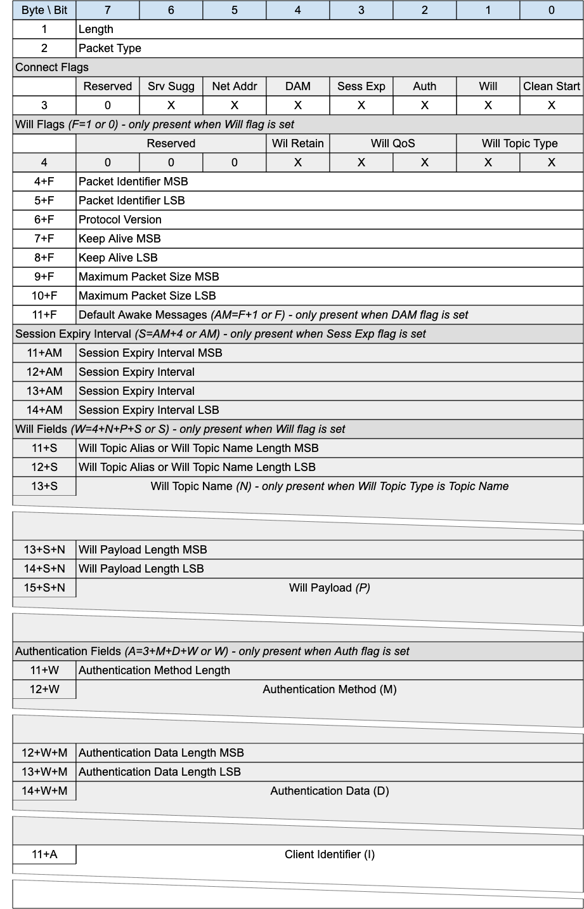

## CONNECT - Connection Request{#connect---connection-request}

*Figure 3-1 -- CONNECT Packet*

\scale=0.9
<!-- .width="5.2in", .height="8.075757874015748in" -->

The CONNECT packet is sent from the Client to the Server to request the creation of or continuation of a Session.

### CONNECT Header{#connect-header}

The first 2 or 4 bytes of the packet are encoded according to the variable length packet header format.Refer to [sec](#structure-of-an-mqtt-sn-control-packet) for a detailed description.

### Connect Flags{#connect-flags}

The Connect Flags is 1 byte field which contains several parameters specifying the behavior of the MQTT-SN Virtual Connection. It also indicates the presence or absence of fields in the Packet.

«<mark title="Requirement MQTT-SN-3.1.2-1">The Server MUST validate that the reserved flags in the CONNECT packet are set to 0</mark>»\[MQTT‑SN‑3.1.2‑1]. If any of the reserved flags is not 0 it is a Malformed Packet. Refer to [sec](#handling-errors) for information about handling errors.

#### Clean Start Flag{#clean-start-flag}

**Position:** bit 0 of the Connect Flags byte.

This flag specifies whether the Virtual Connection starts a new Session or is a continuation of an existing Session. Refer to [sec](#session-state) for a definition of the Session State.

«<mark title="Requirement MQTT-SN-3.1.2.1-1">If a CONNECT packet is received with Clean Start is set to 1, the Client and Server MUST discard any existing Session and start a new Session</mark>»\[MQTT‑SN‑3.1.2.1‑1]. Consequently, the Session Present flag in CONNACK is always set to 0 if Clean Start is set to 1.

«<mark title="Requirement MQTT-SN-3.1.2.1-2">If a CONNECT packet is received with Clean Start set to 0 and there is a Session associated with the Client Identifier, the Server MUST resume communications with the Client based on state from the existing Session</mark>»\<mark title="Ephemeral region marking">MQTT-SN-3.1.2.1-2]. [If a CONNECT packet is received with Clean Start set to 0 and there is no Session associated with the Client Identifier, the Server MUST create a new Session</mark> \[MQTT-3.1.2.1-3\].

#### Will Flag{#will-flag}

**Position:** bit 1 of the Connect Flags byte.

«<mark title="Requirement MQTT-SN-3.1.2.2-1">If the Will Flag is set to 1, the Will Flags, Will Topic, and Will Payload fields MUST be present in the Packet</mark>»\[MQTT‑SN‑3.1.2.2‑1].

«<mark title="Requirement MQTT-SN-3.1.2.2-3">If the Will Flag is set to 1 this indicates that a Will Message MUST be stored on the Server and associated with the Session]{.mark} \[MQTT-SN-3.1.2.2-2\]. The Will Message consists of the Will Topic, and Will Payload fields in the CONNECT Packet. [The Will Message MUST be published after the Virtual Connection is deleted or the Session ends, unless the Will Message has been deleted by the Server on receipt of a DISCONNECT packet with Reason Code 0x00 (Normal disconnection)</mark>»\[MQTT‑SN‑3.1.2.2‑3].

Situations in which the Will Message is published include, but are not limited to:

- The Server deletes the Virtual Connection as a result of an I/O error or network failure it has detected.

- The Client fails to communicate within the Keep Alive time.

- The Server deletes the Virtual Connection because of a protocol error.

- The Server deletes the Virtual Connection because of a Retry timeout.

«<mark title="Requirement MQTT-SN-3.1.2.2-4">The Will Message MUST be removed from the stored Session State in the Server once it has been published or the Server has received a DISCONNECT packet with a Reason Code of 0x00 (Normal disconnection) from the Client</mark>»\[MQTT‑SN‑3.1.2.2‑4].

The Server SHOULD publish Will Messages promptly after the Virtual Connection is deleted or the Session ends, whichever occurs first. In the case of a Server shutdown or failure, the Server MAY defer publication of Will Messages until a subsequent restart. If this happens, there might be a delay between the time the Server experienced failure and when the Will Message is published.

#### Authentication Flag{#authentication-flag}

**Position:** bit 2 of the Connect Flags byte. Labelled *Auth* in Figure 3-1.

«<mark title="Requirement MQTT-SN-3.1.2.3-1">If the Authentication Flag is set to 1, the Authentication Method and Authentication Data fields MUST be present in the Packet</mark>»\[MQTT‑SN‑3.1.2.3‑1].

«<mark title="Requirement MQTT-SN-3.1.2.3-2">If the Authentication Flag is set to 0, the Authentication Method and Authentication Data fields MUST NOT be present in the Packet</mark>»\[MQTT‑SN‑3.1.2.3‑2].

#### Session Expiry Flag{#session-expiry-flag}

**Position:** bit 3 of the Connect Flags byte. Labelled *Sess Exp* in Figure 3-1.

«<mark title="Requirement MQTT-SN-3.1.2.4-1">If the Session Expiry Flag is set to 1, the Session Expiry Interval field MUST be present in the Packet</mark>»\[MQTT‑SN‑3.1.2.4‑1].

«<mark title="Requirement MQTT-SN-3.1.2.4-2">If the Session Expiry Flag is set to 0, the Session Expiry Interval field MUST NOT be present in the Packet</mark>»\[MQTT‑SN‑3.1.2.4‑2].

#### Default Number of Awake Messages Flag{#default-number-of-awake-messages-flag}

**Position:** bit 4 of the Connect Flags byte. Labelled *DAM* in Figure 3-1.

«<mark title="Requirement MQTT-SN-3.1.2.5-1">If the Default Number of Awake Messages Flag is set to 1, the Default Awake Messages field MUST be present in the Packet</mark>»\[MQTT‑SN‑3.1.2.5‑1].

«<mark title="Requirement MQTT-SN-3.1.2.5-2">If the Default Number of Awake Messages Flag is set to 0, the Default Awake Messages field MUST NOT be present in the Packet</mark>»\[MQTT‑SN‑3.1.2.5‑2].

#### Allow Network Address Changes Flag{#allow-network-address-changes-flag}

**Position:** bit 5 of the Connect Flags byte. Labelled *Net Addr* in Figure 3-1.

This flag only has an effect In implementations which use a Network Address to associate incoming packets with a Virtual Connection, otherwise it should be 0.

Setting this flag to 1 means that the Client authorizes the server to update the Network Address associated with a Virtual Connection. The Client does this by sending a Connection Encapsulated Packet with the Client Identifier. If its Network Address has changed, the Server can update the Virtual Connection.

«<mark title="Requirement MQTT-SN-3.1.2.6-1">If this flag is set to 0 and a Packet is wrapped by the Connection Encapsulation, it is a protocol error. The Server must send a DISCONNECT and delete the Virtual Connection</mark>»\[MQTT‑SN‑3.1.2.6‑1].

This flag affects the use of the Connection Encapsulation only, it does not affect other methods of identifying the sender such as the Protection Encapsulation.

#### Allow Server Suggested Values Flag{#allow-server-suggested-values-flag}

**Position:** bit 6 of the Connect Flags byte. Labelled *Srv Sugg* in Figure 3-1.

If this flag is set to 1, the Client allows the Server to return modified values for all of:

- Keep Alive, in the CONNACK Packet

- Session Expiry, in the CONNACK Packet

- Sleep Duration in the SLEEPRESP Packet

for the Virtual Connection.

«<mark title="Requirement MQTT-SN-3.1.2.7-1">If this flag is set to 0, the Server MUST NOT include a Server Keep Alive field in the CONNACK Packet response</mark>»\[MQTT‑SN‑3.1.2.7‑1].

«<mark title="Requirement MQTT-SN-3.1.2.7-2">If this flag is set to 0, the Server MUST NOT include a Session Expiry field in the CONNACK Packet response</mark>»\[MQTT‑SN‑3.1.2.7‑2].

«<mark title="Requirement MQTT-SN-3.1.2.7-3">If this flag is set to 0 for the current Virtual Connection, the Server MUST NOT include a Sleep Duration in the SLEEPRESP Packet</mark>»\[MQTT‑SN‑3.1.2.7‑3].

### Will Flags{#will-flags}

«<mark title="Requirement MQTT-SN-3.1.3-1">If the Will Flag is set to 0, the Will Flags MUST NOT be present in the Packet</mark>»\[MQTT‑SN‑3.1.3‑1].

«<mark title="Requirement MQTT-SN-3.1.3-2">If the Will Flag is set to 1, the Will Flags MUST be present in the Packet</mark>»\[MQTT‑SN‑3.1.3‑2].

The *Will Flags* is 1 byte field which contains several parameters specifying the handling of the Will Message.

#### Will Topic Type{#will-topic-type}

**Position:** bits 1 and 0 of the Will Flags byte.

This is a 2-bit field which determines the format of the topic value. Refer to [sec](#topic-types) for the definition of the various topic types.

#### Will QoS{#will-qos}

**Position:** bits 3 and 2 of the Will Flags byte.

These two bits specify the QoS level to be used. The value of Will QoS can be 0 (0x00), 1 (0x01), or 2 (0x02). A value of 3 (0x03) is a Malformed Packet.

#### Will Retain{#will-retain}

**Position:** bit 4 of the Will Flags byte.

This specifies if the Will Message is to be retained when it is published. See [sec](#retained-messages) for more information about Retained Messages.

«<mark title="Requirement MQTT-SN-3.1.3.3-1">If the Will Flag is set to 1 and Will Retain is set to 0, the Server MUST publish the Will Message as a non-retained message</mark>»\[MQTT‑SN‑3.1.3.3‑1].

«<mark title="Requirement MQTT-SN-3.1.3.3-2">If the Will Flag is set to 1 and Will Retain is set to 1, the Server MUST publish the Will Message as a retained message</mark>»\[MQTT‑SN‑3.1.3.3‑2].

### Packet Identifier{#cp---packet-identifier}

Used to identify the corresponding CONNACK or AUTH packet. It should ideally be populated with a random Two Byte Integer value.

### Protocol Version{#protocol-version}

The one-byte unsigned value that represents the revision level of the protocol used by the Client.

*Figure 3-2 -- Protocol Versions*

| Protocol Version        |    Value    |
|:------------------------|:-----------:|
| Version 1.2             |    0x01     |
| **Version 2.0**         |  **0x02**   |
| Reserved for future use | 0x03 – 0xFF |

Table: Protocol Versions

«<mark title="Requirement MQTT-SN-3.1.5-1">The value of the Protocol Version field for MQTT-SN version 2.0 MUST be 2 (0x02)</mark>»\[MQTT‑SN‑3.1.5‑1].

A Server which supports multiple versions of the MQTT-SN protocol uses the Protocol Version to determine which version of MQTT-SN the Client is using. «<mark title="Requirement MQTT-SN-3.1.5-2">If the Protocol Version is not 2 and the Server does not want to accept the CONNECT packet, the Server MAY send a CONNACK packet with Reason Code 0x84 (Unsupported Protocol Version)</mark>»\[MQTT‑SN‑3.1.5‑2].

### Keep Alive{#keep-alive}

The Keep Alive is a Two Byte Integer greater than 0 (1 - 65,535), which is a time interval measured in seconds. It is the maximum time interval that is permitted to elapse between the point at which the Client finishes transmitting one MQTT-SN Control Packet and the point it starts sending the next. It is the responsibility of the Client to ensure that the interval between MQTT-SN Control Packets being sent does not exceed the Keep Alive value. «<mark title="Requirement MQTT-SN-3.1.6-1">In the absence of sending any other MQTT-SN Control Packets, the Client MUST send a PINGREQ packet</mark>»\[MQTT‑SN‑3.1.6‑1].

> **Informative comment**
>
> The Client can send PINGREQ at any time, irrespective of the Keep Alive value, and check for a corresponding PINGRESP to determine that the network and the Server are available.

«<mark title="Requirement MQTT-SN-3.1.6-2">If the Server does not receive an MQTT-SN Control Packet from the Client within one and a half times the Keep Alive time period, it MUST delete the Virtual Connection and move the Client to the Disconnected state (see [sec](#client-states))</mark>»\[MQTT‑SN‑3.1.6‑2].

«<mark title="Requirement MQTT-SN-3.1.6-3">If a Client does not receive a PINGRESP packet within a *[Retry Interval]* amount of time after it has sent a PINGREQ, it SHOULD retry the transmission according to [sec](#unacknowledged-packets) up to the maximum number of attempts. If a PINGRESP is still not received it MUST delete the Virtual Connection to the Server by way of a DISCONNECT, with the understanding that the Server may no longer be reachable</mark>»\[MQTT‑SN‑3.1.6‑3].

> **Informative Comment**
>
> Unlike MQTT, the MQTT-SN Keep Alive timeout can not be turned off (by setting a value of 0). This is because there is no other indication in MQTT-SN of a connection failure, as there is in MQTT with the underlying TCP/IP connection.

«<mark title="Requirement MQTT-SN-3.1.6-4">The Keep Alive must have a value greater than 0. It is a protocol error if a Keep Alive value of 0 or below is set</mark>»\[MQTT‑SN‑3.1.6‑4].

> **Informative comment**\
> The Server may have other reasons to disconnect the Client, for instance because it is shutting down. Setting Keep Alive does not guarantee that the Client will remain connected.
>
> **Informative comment**
>
> The actual value of the Keep Alive is application specific; typically, this is a few minutes. The maximum value of 65,535 is 18 hours 12 minutes and 15 seconds.
>
> **Informative Comment**
>
> Clients can use the Keep Alive procedure to supervise the liveliness of the Server to which they are connected. If a Client does not receive a PINGRESP from the Server even after multiple retransmissions of the PINGREQ packet and deletes the Virtual Connection, it might try to connect to another Server before trying to reconnect to this Server.

### Maximum Packet Size{#maximum-packet-size}

A Two Byte (16-bit) Integer representing the Maximum Packet Size the Client is willing to accept. If the Maximum Packet Size is set to 0, no limit on the packet size is imposed beyond the limitations in the protocol as a result of the remaining length encoding and the protocol header sizes.

> **Informative comment**
>
> It is the responsibility of the application to select a suitable Maximum Packet Size value if it chooses to restrict the Maximum Packet Size.

The packet size is the total number of bytes in an MQTT-SN Control Packet, as defined in [sec](#structure-of-an-mqtt-sn-control-packet). The Client uses the Maximum Packet Size to inform the Server that it will not process packets exceeding this limit.

«<mark title="Requirement MQTT-SN-3.1.7-1">The Maximum Packet Size value MUST be 10 or greater</mark>»\<mark title="Ephemeral region marking">MQTT-SN-3.1.7-1][,</mark> as this is the minimum size that the CONNECT Packet can be.

«<mark title="Requirement MQTT-SN-3.1.7-2">The Server MUST NOT send packets exceeding Maximum Packet Size to the Client. If a Client receives a packet whose size exceeds this limit, this is a Protocol Error, the Client uses DISCONNECT with Reason Code 0x95 (Packet too large)</mark>»\[MQTT‑SN‑3.1.7‑2].

«<mark title="Requirement MQTT-SN-3.1.7-3">Where a Packet is too large to send, the Server MUST discard it without sending it and then behave as if it had completed sending that Application Message</mark>»\[MQTT‑SN‑3.1.7‑3].

> **Informative comment**
>
> Where a packet is discarded without being sent, the Server could take some diagnostic action including alerting the Server administrator. Such actions are outside the scope of this specification.

### Default Awake Messages{#default-awake-messages}

An optional single byte value to indicate the maximum number of messages a Client shall receive during an AWAKE session. If this field is 0, or is absent, it is up to the Server to determine how many messages it will send, which may be unbounded.

### Session Expiry Interval{#session-expiry-interval}

The Session Expiry Interval is a four-byte integer time interval measured in seconds. If the Session Expiry Interval is absent the value 0 is used. If the Session Expiry Interval is set to 0, or is absent, the Session ends when the Virtual Connection is deleted by the Client or Server.

If the Session Expiry Interval is 0xFFFFFFFF (UINT_MAX), the Session does not expire.

«<mark title="Requirement MQTT-SN-3.1.9-1">The Client and Server MUST store the Session State after the Virtual Connection is deleted if the Session Expiry Interval is greater than 0</mark>»\[MQTT‑SN‑3.1.9‑1].

> **Informative comment**
>
> The clock in the Client or Server may not be running for part of the time interval, for instance because the Client or Server are not running. This might cause the deletion of the state to be delayed.
>
> **Informative comment**
>
> The client and Server between them should negotiate a reasonable and practical session expiry interval according to the network and infrastructure environment in which they are deployed. For example, it would not be practical to set a session expiry interval of many months on a Server whose hardware is only capable of storing a few client sessions.
>
> **Informative comment**
>
> A Client that only wants to process messages while connected will set Clean Start to 1 and set the Session Expiry Interval to 0. It will not receive Application Messages published before it is connected and has to subscribe afresh to any topics that it is interested in each time it connects.
>
> **Informative comment**
>
> The Client should always use the Session Present flag in the CONNACK to determine whether the Server has a Session State for this Client.

### Will Topic Alias or Will Topic Name Length{#will-topic-alias-or-will-topic-name-length}

If the Will Flag is set to 1, the Will Topic Alias or Will Topic Name Length is the next field in the Packet. In both cases, this is two bytes.

In the case of Will Topic Type being Topic Name, this field will refer to the length of the Will Topic Name field. In the other cases, this will be the value used as the Will Topic Alias.

### Will Topic Name{#will-topic-name}

If the Will Flag is set to 1 and the Will Topic Type is set to Topic Name (0b11), the Will Topic Name is the next field in the Packet. «<mark title="Requirement MQTT-SN-3.1.11-1">The Will Topic Name MUST be a UTF-8 Encoded String as defined in [sec](#utf-8-encoded-string)</mark>»\[MQTT‑SN‑3.1.11‑1].

### Will Payload Length{#will-payload-length}

If the Will Flag is set to 1, the Will Payload Length is the next field in the Packet. It contains the length of the Will Payload field.

### Will Payload{#will-payload}

If the Will Flag is set to 1, the Will Payload is the next field in the Packet. The Will Payload defines the Application Message Payload that is to be published to the Will Topic as described in [sec](#will-flag). This field consists of Binary Data.

### Authentication Method Length{#authentication-method-length}

If the Auth Flag is set to 1, the Authentication Method Length is the next field in the Packet. It is a single byte value (max 0-255 bytes), representing the length of the field used to specify the authentication method. Refer to [sec](#authentication) for more information about authentication.

### Authentication Method{#authentication-method}

If the Auth Flag is set to 1, the Authentication Method is the next field in the Packet. It is a UTF-8 Encoded String containing the name of the Authentication Method.

To support the equivalent of the MQTT User Name and Password fields in the CONNECT packet, see [sec](#mqtt-user-name-and-password-support).

Refer to [sec](#authentication) for more information about authentication.

### Authentication Data Length{#authentication-data-length}

If the Auth Flag is set to 1, the Authentication Data Length is the next field in the Packet. It is a two byte value (max 0-65535 bytes), representing the length of the field used to specify the authentication data. Refer to [sec](#authentication) for more information about authentication.

### Authentication Data{#authentication-data}

If the Auth Flag is set to 1, the Authentication Data is the next field in the Packet.

Binary Data containing authentication data. The contents of this data are defined by the authentication method.

To support the equivalent of the MQTT User Name and Password CONNECT packet fields, see [sec](#mqtt-user-name-and-password-support).

Refer to [sec](#authentication) for more information about authentication.

### Client Identifier{#client-identifier}

«<mark title="Requirement MQTT-SN-3.1.18-1">The Client Identifier MUST be a UTF-8 Encoded String</mark>»\[MQTT‑SN‑3.1.18‑1]. This field is optional - its existence or absence is inferred from the Packet length.

The Client Identifier identifies the Client to the Server. Each Client connecting to the Server has a unique Client Identifier. «<mark title="Requirement MQTT-SN-3.1.18-2">The Client Identifier MUST be used by Clients and by Server to identify the state that they hold relating to this MQTT-SN Session between the Client and the Server</mark>»\[MQTT‑SN‑3.1.18‑2].

> **Informative comment**
>
> A Client Identifier can be between 0 - 65,521 bytes. It is recommended for practicality, Client Identifiers are restricted to a reasonable size (less than 243 bytes to fit within a small CONNECT packet).

«<mark title="Requirement MQTT-SN-3.1.18-3">When the Client Identifier is present (greater than 0 bytes), the Server MUST allow values which are between 1 and 23 UTF-8 encoded bytes in length, and that contain only the characters \"0123456789abcdefghijklmnopqrstuvwxyzABCDEFGHIJKLMNOPQRSTUVWXYZ"</mark>»\[MQTT‑SN‑3.1.18‑3].

«<mark title="Requirement MQTT-SN-3.1.18-4">The Server MAY choose to allow more than 23 bytes</mark>»\[MQTT‑SN‑3.1.18‑4].

> **Informative comment**
>
> The minimum supported length of between 1 and 23 bytes for the Client Identifier in the Server is for compatibility with MQTT. A longer length might be necessary to be supported if a UUID is used as an Assigned Client Identifier as suggested in [sec](#assigned-client-identifier).

### CONNECT Actions{#connect-actions}

Note that a Server MAY support multiple protocols on the same network endpoint. If the Server determines that the protocol is MQTT-SN 2.0 then it validates the connection attempt as follows.

1.  «<mark title="Requirement MQTT-SN-3.1.19-1">The Server MUST validate that the CONNECT packet matches the format described in [sec](#connect---connection-request) and MUST NOT create a Virtual Connection for this CONNECT if it does not match</mark>»\[MQTT‑SN‑3.1.19‑1]. The Server MAY send a CONNACK with a Reason Code of 0x80 or greater as described in [sec](#handling-errors).

2.  «<mark title="Requirement MQTT-SN-3.1.19-2">The Server MAY check that the contents of the CONNECT packet meet any further restrictions and SHOULD perform authentication and authorization checks. If any of these checks fail, it MUST NOT create a Virtual Connection for this CONNECT</mark>»\[MQTT‑SN‑3.1.19‑2]. It MAY send an appropriate CONNACK response with a Reason Code of 0x80 or greater as described in [sec](#connack---connect-acknowledgement) and [sec](#handling-errors).

If validation is successful, the Server performs the following steps.

1.  «<mark title="Requirement MQTT-SN-3.1.19-3">If the Client Identifier represents a Client already connected to the Server, the Server sends a DISCONNECT packet to the existing Client with Reason Code of 0x8E (Session taken over) as described in [sec](#handling-errors) and MUST delete the Virtual Connection of the existing Client</mark>»\[MQTT‑SN‑3.1.19‑3]. If the existing Client has a Will Message, that Will Message is published as described in [sec](#will-flags).

2.  «<mark title="Requirement MQTT-SN-3.1.19-4">The Server MUST perform the processing of Clean Start that is described in [sec](#clean-start-flag)</mark>»\[MQTT‑SN‑3.1.19‑4].

3.  «<mark title="Requirement MQTT-SN-3.1.19-5">The Server MUST acknowledge the CONNECT packet with a CONNACK packet containing a 0x00 (Success) Reason Code</mark>»\[MQTT‑SN‑3.1.19‑5].

4.  Start Application Message delivery and Keep Alive monitoring.

> **Informative comment**
>
> It is recommended that authentication and authorization checks be performed if the Server is being used to process any form of business critical data. If these checks succeed, the Server responds by sending CONNACK with a 0x00 (Success) Reason Code. If they fail, it is suggested that the Server does not send a CONNACK at all, as this could alert a potential attacker to the presence of the MQTT-SN Server and encourage such an attacker to launch a denial of service or password-guessing attack.

«<mark title="Requirement MQTT-SN-3.1.19-6">A Client MUST wait for a CONNACK packet with a 0x00 (Success) Reason Code before sending any packet that needs a Virtual Connection</mark>»\[MQTT‑SN‑3.1.19‑6].

«<mark title="Requirement MQTT-SN-3.1.19-7">The Server MUST NOT process any data sent by the Client after the CONNECT packet and before the CONNACK response is sent, except AUTH packets</mark>»\[MQTT‑SN‑3.1.19‑7].
