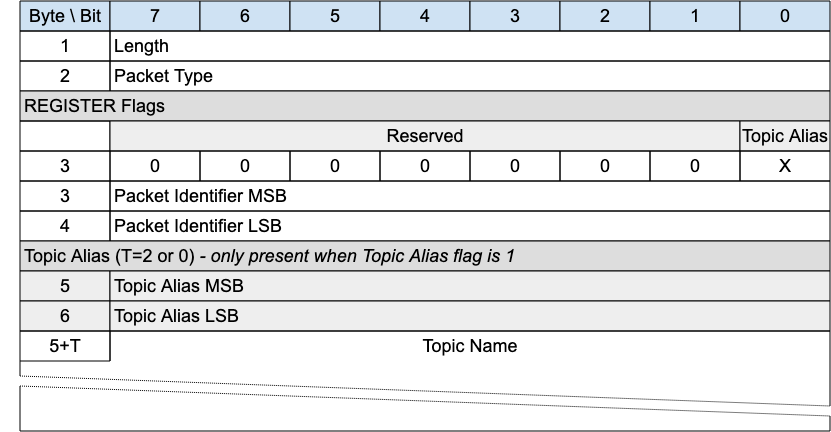

## REGISTER - Register Topic Alias Request{#register---register-topic-alias-request}

*Figure 3-5 -- REGISTER Packet*

<!-- .width="6.5in", .height="3.375in" -->

A REGISTER packet is sent by a Client or Server to create a Session Topic Alias, before sending a PUBLISH with that Session Topic Alias.

The REGISTER packet is sent by a Client to a Server to request a Session Topic Alias for the included Topic Name.

It is sent by a Server to inform a Client about the Session Topic Alias it has assigned to the included Topic Name.

Topic Aliases are always assigned and managed by the Server, not the Client. For more information see [[4.7.2 Topic Aliases]](#topic-aliases).

A REGISTER packet may be sent by the Server when the Client is in the Awake state if the Retain Topic Aliases flag on the SLEEPREQ was set to 0, to reinform the Client of a Session Topic Alias.

«<mark title="Requirement MQTT-SN-3.4-1">If the REGISTER packet is sent by a Client, it MUST NOT contain a Topic Alias</mark>»\[MQTT‑SN‑3.4‑1].

«<mark title="Requirement MQTT-SN-3.4-2">If the REGISTER packet is sent by a Server, it MUST contain a Topic Alias</mark>»\[MQTT‑SN‑3.4‑2].

### REGISTER Header{#register-header}

The first 2 or 4 bytes of the packet are encoded according to the variable length packet header format. Refer to [[2.1 Structure of an MQTT-SN Control Packet]](#structure-of-an-mqtt-sn-control-packet) for a detailed description.

### REGISTER Flags{#register-flags}

The REGISTER Flags is a 1 byte field which contains flags specifying the contents of the REGISTER packet. «<mark title="Requirement MQTT-SN-3.4.2-1">Bits 7-1 of the REGISTER Flags are reserved and MUST be set to 0</mark>»\[MQTT‑SN‑3.4.2‑1].

«<mark title="Requirement MQTT-SN-3.4.2-2">The receiver MUST validate that the reserved flags in the REGISTER packet are set to 0. If any of the reserved flags is not 0 it is a Malformed Packet</mark>»\[MQTT‑SN‑3.4.2‑2].

#### Topic Alias Flag{#rrtar-topic-alias-flag}

**Position**: bit 0 of the REGISTER Flags.

Determines the presence of the Topic Alias field.

«<mark title="Requirement MQTT-SN-3.4.2.1-1">If the Topic Alias Flag is set to 0, a Topic Alias MUST NOT be present in the Packet</mark>»\[MQTT‑SN‑3.4.2.1‑1].

«<mark title="Requirement MQTT-SN-3.4.2.1-2">If the Topic Alias Flag is set to 1, a Topic Alias MUST be present in the Packet</mark>»\[MQTT‑SN‑3.4.2.1‑2].

### Packet Identifier{#rrtar---packet-identifier}

Used to identify the corresponding REGACK packet. It should ideally be populated with a random Two Byte Integer value.

### Topic Alias{#rrtar---topic-alias}

Contains the Topic Alias value assigned to the Topic Name included in the Topic Name field.

### Topic Name{#rrtar---topic-name}

Fixed Length UTF-8 Encoded String Contains the fully qualified topic name.

### REGISTER Actions{#register-actions}

As described in [[4.7.2 Topic Aliases]](#topic-aliases).
