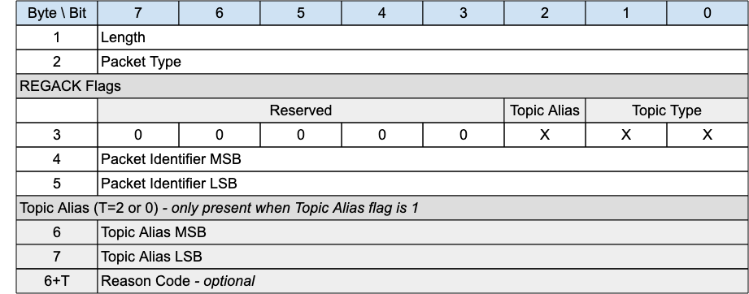

## REGACK - Register Topic Alias Acknowledgement{#regack---register-topic-alias-acknowledgement}

*Figure 3-6 -- REGACK Packet*

<!-- .width="6.5in", .height="2.5555555555555554in" -->

The REGACK packet is sent by a Client or by a Server as an acknowledgment to the receipt and processing of a REGISTER packet.

### REGACK Header{#regack-header}

The first 2 or 4 bytes of the packet are encoded according to the variable length packet header format. Refer to [[2.1 Structure of an MQTT-SN Control Packet]](#structure-of-an-mqtt-sn-control-packet) for a detailed description.

### REGACK Flags{#regack-flags}

The REGACK Flags is a 1 byte field which contains flags specifying the contents of the REGACK packet. «<mark title="Requirement MQTT-SN-3.5.2-1">Bits 7-3 of the REGACK Flags are reserved and MUST be set to 0</mark>»\[MQTT‑SN‑3.5.2‑1].

«<mark title="Requirement MQTT-SN-3.5.2-2">The Client MUST validate that the reserved flags in the REGACK packet are set to 0. If any of the reserved flags is not 0 it is a Malformed Packet</mark>»\[MQTT‑SN‑3.5.2‑2].

#### Topic Type{#rrtaa---topic-type}

**Position**: bits 0 and 1 of the REGACK Flags.

Determines the format of the topic value. Refer to [[2.4 Topic Types]](#topic-types) for the definition of the various topic types.

«<mark title="Requirement MQTT-SN-3.5.2.1-1">The Topic Type in the REGACK packet MUST be Predefined Topic Alias or Session Topic Alias</mark>»\[MQTT‑SN‑3.5.2.1‑1]. Any other value is a Protocol Error.

> **Informative Comment**
>
> A Predefined Topic Alias can be returned in the REGACK Packet if a Client tries to register a Session Topic Alias for a Topic Name which the Server already knows is a Predefined Topic Alias. See [[4.7.2.2 Session Topic Aliases]](#session-topic-aliases) for details.

#### Topic Alias Flag{#rrtaa---topic-alias-flag}

**Position**: bit 2 of the REGISTER Flags.

Determines the presence of the Topic Alias field.

«<mark title="Requirement MQTT-SN-3.5.2.2-1">If the Topic Alias Flag is set to 0, a Topic Alias MUST NOT be present in the Packet</mark>»\[MQTT‑SN‑3.5.2.2‑1].

«<mark title="Requirement MQTT-SN-3.5.2.2-2">If the Topic Alias Flag is set to 1, a Topic Alias MUST be present in the Packet</mark>»\[MQTT‑SN‑3.5.2.2‑2].

### Packet Identifier{#rrtaa---packet-identifier}

The same value as the Packet Identifier in the REGISTER packet being acknowledged.

### Topic Alias{#rrtaa---topic-alias}

A Topic Alias is a Two Byte Integer value that is used to identify the Topic instead of the Topic Name. This numeric value is used as the Topic Alias.

If the REGACK is sent by a Server in response to a REGISTER request from a Client, the Topic Alias is that which has been assigned by the Server, and which the Client should use during the rest of the Session to refer to the Topic Name identified in the REGISTER packet.

If the REGACK is sent by a Client, it is in response to a REGISTER packet from a Server informing the Client which Topic Alias it should use. «<mark title="Requirement MQTT-SN-3.5.4-1">When sent by a Client the REGACK MUST NOT contain a Topic Alias</mark>»\[MQTT‑SN‑3.5.4‑1].

### Reason Code{#rrtaa---reason-code}

The Reason Code for the REGACK packet is optional - its existence is inferred from the Packet length. If not provided, 0x00 (Success) is assumed.

The values for Reason Codes are shown in «<mark title="Requirement MQTT-SN-3.5.5-1">[2.3 Reason Code]](#reason-code). [The sender of the REGACK Packet MUST use one of the Reason Codes applicable to REGACK</mark>»\[MQTT‑SN‑3.5.5‑1].
