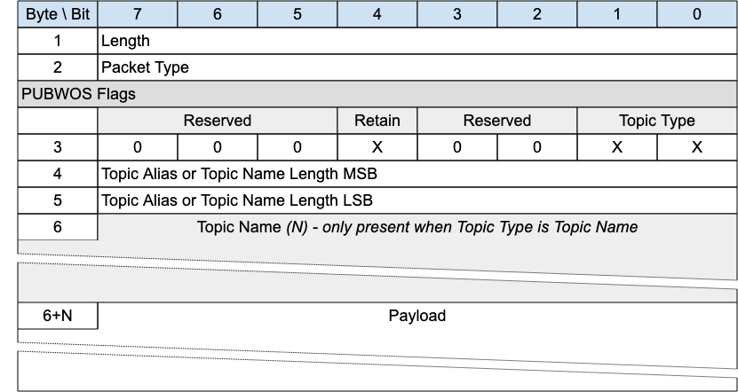
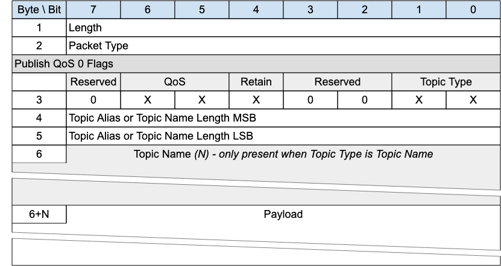
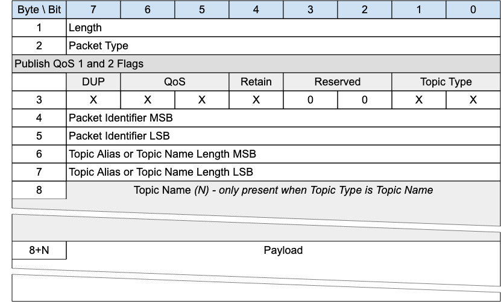
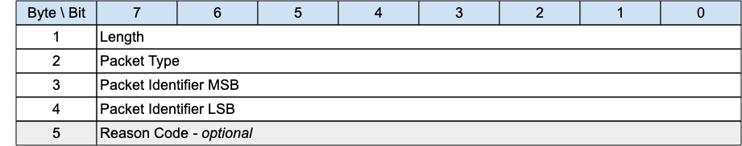

## Publish Requests and Responses{#publish-requests-and-responses}

MQTT-SN is designed to be optimized for packet size. For this reason, publish requests have 3 variants:

1.  PUBWOS, Publish Without Session, where no session is required

2.  PUBLISH Quality of Service 0 where no response is required and thus no packet identifier

3.  PUBLISH Quality of Service 1 and 2 where a response is expected.

The table below shows the two packet types.

*Figure 3-7 -- Publish Packet Types*

| Packet Name | Type | Description |
| :---- | :---- | ----- |
| **Publish** | 0x0C | A PUBLISH packet corresponding to Quality of Service (QoS) 0, 1 or 2 |
| **Publish Without Session** | 0x11 | A PUBWOS Packet sent by a Client and does not need not to have an active Session |

### PUBWOS - Publish Without Session{#pubwos---publish-without-session}

*Figure 3-8 -- PUBWOS Packet*

<!-- .width="6.5in", .height="3.4583333333333335in" -->

This packet is used by both clients and Servers to publish data for a certain topic.

The PUBWOS packet does not have a corresponding feature in MQTT. «<mark title="Requirement MQTT-SN-3.6-1">If forwarded to an MQTT connection, PUBWOS packets MUST have their MQTT Quality of Service level set to 0</mark>»\[MQTT‑SN‑3.6‑1].

> **Informative comment**
>
> PUBWOS packets received by a Server are not associated with a MQTT-SN Client Session and can be optionally discarded by the Server without being processed for onward delivery.
>
> **Informative comment**
>
> If the Transport Layer supports multicast, like UDP/IP, the PUBWOS packet can be sent using a multicast address as the destination.

#### PUBWOS Header{#pubwos-header}

The first 2 or 4 bytes of the packet are encoded according to the variable length packet header format. Refer to [[2.1 Structure of an MQTT-SN Control Packet]](#structure-of-an-mqtt-sn-control-packet) for a detailed description.

#### PUBWOS Flags{#pubwos-flags}

The PUBWOS Flags is a 1 byte field which contains flags specifying the content of the packet and the Server behavior on receipt. «<mark title="Requirement MQTT-SN-3.6.1.2-1">Bits 7-5 and 3-2 of the PUBWOS FLAGS are reserved and MUST be set to 0</mark>»\[MQTT‑SN‑3.6.1.2‑1].

«<mark title="Requirement MQTT-SN-3.6.1.2-2">The Client MUST validate that the reserved flags in the PUBWOS packet are set to 0. If any of the reserved flags is not 0 it is a Malformed Packet</mark>»\[MQTT‑SN‑3.6.1.2‑2].

##### Topic Type{#ppws---topic-type}

**Position**: bits 0 and 1 of the PUBWOS Flags.

This determines the format of the topic data field. Refer to «<mark title="Requirement MQTT-SN-3.6.1.2.1-1">[2.4 Topic Types]](#topic-types) for the definition of the topic types. [The Topic Type in the PUBWOS packet MUST be Predefined Topic Alias or Topic Name</mark>»\[MQTT‑SN‑3.6.1.2.1‑1].

##### Retain{#ppws---retain}

**Position**: bit 4 of the PUBWOS Flags.

This field signifies whether the existing Retained Message for this topic is replaced or kept. For a detailed description of Retained Messages see [[4.13 Retained Messages]](#retained-messages).

#### Topic Alias or Topic Name Length{#ppws--topic-alias-or-topic-name-length}

This field is 2 bytes. It contains the Topic Name length if the Topic Type is Topic Name, or a predefined Topic Alias if the Topic Type is Predefined Topic Alias. Determines the topic which this payload will be published to.

#### Topic Name{#ppws---topic-name}

«<mark title="Requirement MQTT-SN-3.6.1.4-1">If the Topic Type is Topic Name, the Topic Name field MUST be present in the PUBWOS packet</mark>»\[MQTT‑SN‑3.6.1.4‑1].

«<mark title="Requirement MQTT-SN-3.6.1.4-2">If the Topic Type is Predefined Topic Alias, the Topic Name field MUST NOT be present in the PUBWOS packet</mark>»\[MQTT‑SN‑3.6.1.4‑2].

If the Topic Type is Topic Name this field will be a UTF-8 encoded string value of length determined by the Topic Name Length field.

#### Payload{#ppws---payload}

The Payload contains the payload data of the Application Message that is being published. This field consists of Binary Data.The content and format of the data is application specific. It is valid for a PUBWOS packet to contain a zero length Payload.

#### PUBWOS Actions{#pubwos-actions}

The Client or Server uses a PUBWOS packet to send an Application Message to a Network Address, for possible receipt by a Server or another Client.

«<mark title="Requirement MQTT-SN-3.6.1.6-1">If received by a Client or Server, the PUBWOS packet MUST be treated as if its QoS were 0</mark>»\[MQTT‑SN‑3.6.1.6‑1] as described in [[3.6.3.7 PUBLISH Actions]](#publish-actions).

### PUBLISH with QoS 0{#publish-with-qos-0}

*Figure 3-9 -- PUBLISH Packet for QoS 0*

<!-- .width="6.5in", .height="3.4583333333333335in" -->

A PUBLISH packet is sent from a Client to a Server or from a Server to a Client to transport an Application Message.

«<mark title="Requirement MQTT-SN-3.6.1.2-1">PUBLISH packets with QoS equal to 0 received by a Client or Server MUST be associated with a Session</mark>»\[MQTT‑SN‑3.6.1.2‑1].

#### PUBLISH Header{#publish-header}

The first 2 or 4 bytes of the packet are encoded according to the variable length packet header format. Refer to [[2.1 Structure of an MQTT-SN Control Packet]](#structure-of-an-mqtt-sn-control-packet) for a detailed description.

#### PUBLISH Flags{#publish-flags}

The PUBLISH Flags is a 1 byte field which contains flags specifying the content of the packet and the Server behavior. «<mark title="Requirement MQTT-SN-3.6.2.2-1">Bits 7 and 3-2 of the PUBLISH Flags are reserved and MUST be set to 0</mark>»\[MQTT‑SN‑3.6.2.2‑1].

«<mark title="Requirement MQTT-SN-3.6.2.2-2">The Client MUST validate that the reserved flags in the PUBLISH packet are set to 0. If any of the reserved flags is not 0 it is a Malformed Packet</mark>»\[MQTT‑SN‑3.6.2.2‑2].

##### Topic Type{#pwq0---topic-type}

**Position**: bits 0 and 1 of the PUBLISH Flags.

This determines the content of the Topic Alias and Topic Name fields. Refer to [[2.4 Topic Types]](#topic-types) for the definition of the various topic types.

The Topic Type may be Topic Name, Predefined Topic Alias or Session Topic Alias.

##### QoS{#pwq0---qos}

**Position**: bits 5 and 6 of the PUBLISH Flags.

This field is set to "0b00" for QoS 0. For a detailed description of the various Quality Of Service levels refer to [[4.3 Quality of Service levels and protocol flows]](#quality-of-service-levels-and-protocol-flows).

##### Retain{#pwq0---retain}

**Position**: bit 4 of the PUBLISH Flags.

This flag signifies whether the message is published as a retained message or not. See [[4.13 Retained Messages]](#retained-messages) for more information about Retained Messages.

#### Topic Alias or Topic Name Length{#ppwq0---topic-alias-or-topic-name-length}

Contains 2 bytes of Topic Name Length if the Topic Type is Topic Name, or the Predefined or Session Topic Alias if the Topic Type is Predefined Topic Alias or Session Topic Alias respectively.

#### Topic Name{#pwq0---topic-name}

«<mark title="Requirement MQTT-SN-3.6.2.4-1">If the Topic Type is Topic Name (0b11), the Topic Name field MUST be present in the PUBLISH packet</mark>»\[MQTT‑SN‑3.6.2.4‑1].

«<mark title="Requirement MQTT-SN-3.6.2.4-2">If the Topic Type is Predefined Topic Alias or Session Topic Alias, then the Topic Name field MUST NOT be present in the PUBLISH packet</mark>»\[MQTT‑SN‑3.6.2.4‑2].

Topic Name is a UTF-8 encoded string of length Topic Length.

#### Payload{#pwq0---payload}

The Payload contains the payload data of the Application Message that is being published. This field consists of Binary Data. The content and format of the data is application specific. It is valid for a PUBLISH packet to contain a zero length Payload.

#### PUBLISH - QoS 0 Actions{#publish---qos-0-actions}

As described in [[3.6.3.7 PUBLISH Actions]](#publish-actions).

### PUBLISH with QoS 1 and 2{#publish-with-qos-1-and-2}

*Figure 3-10 -- PUBLISH Packet for QoS 1 and 2*

<!-- .width="6.5in", .height="3.9305555555555554in" -->

A PUBLISH packet is sent from a Client to a Server or from a Server to a Client to transport an Application Message.

«<mark title="Requirement MQTT-SN-3.6.3-1">PUBLISH packets with QoS equals to 1 or 2 received by a Client or Server MUST be associated with a Session</mark>»\[MQTT‑SN‑3.6.3‑1].

#### PUBLISH Header{#pwq1a2---publish-header}

The first 2 or 4 bytes of the packet are encoded according to the variable length packet header format. Refer to [[2.1 Structure of an MQTT-SN Control Packet]](#structure-of-an-mqtt-sn-control-packet) for a detailed description.

#### PUBLISH Flags{#pwq1a2---publish-flags}

The PUBLISH Flags is a 1 byte field which contains flags specifying the content of the packet and the Server behavior. «<mark title="Requirement MQTT-SN-3.6.3.2-1">Bits 3-2 of the PUBLISH Flags are reserved and MUST be set to 0</mark>»\[MQTT‑SN‑3.6.3.2‑1].

«<mark title="Requirement MQTT-SN-3.6.3.2-2">The Client MUST validate that the reserved flags in the PUBLISH packet are set to 0. If any of the reserved flags is not 0 it is a Malformed Packet</mark>»\[MQTT‑SN‑3.6.3.2‑2].

##### Topic Type{#pwq1a2---topic-type}

**Position**: bits 0 and 1 of the PUBLISH Flags.

This determines the format of the Topic Data field. Refer to [[2.4 Topic Types]](#topic-types) for the definition of Topic Types.

The Topic Type may be Topic Name, Predefined Topic Alias or Session Topic Alias.

##### QoS{#pwq1a2---qos}

**Position**: bits 5 and 6 of the PUBLISH Flags.

Quality of Service - as in MQTT. The QoS levels are:

*Figure 3-11 -- QoS Definitions*

| QoS value | Bit 6 | bit 5 | Description |
| :---: | :---: | :---: | ----- |
| 0 | 0 | 0 | At most once delivery |
| 1 | 0 | 1 | At least once delivery |
| 2 | 1 | 0 | Exactly once delivery |
| \- | 1 | 1 | Reserved – must not be used |

For a detailed description of the various Quality Of Service levels refer to [[4.3 Quality of Service levels and protocol flows]](#quality-of-service-levels-and-protocol-flows).

##### DUP{#dup}

**Position**: bit 7 of the PUBLISH Flags.

The DUP flag indicates the duplicate delivery of QoS 2 PUBLISH packets. If the DUP flag is set to 0, it signifies that the packet is sent for the first time. If the DUP flag is set to 1, it signifies that the packet is retransmitted.

##### Retain{#pwq1a2---retain}

**Position**: bit 4 of the PUBLISH Flags.

This flag signifies whether the message is published as a retained message or not. See [[4.13 Retained Messages]](#retained-messages) for more information about Retained Messages.

#### Packet Identifier{#pwq1a2---packet-identifier}

Used to identify the corresponding PUBACK packet in the case of QoS 1. Used to identify the corresponding PUBREC, PUBREL and PUBCOMP packets in the case of QoS 2. It should ideally be populated with a random Two Byte Integer value.

#### Topic Alias or Topic Name Length{#pwq1a2---topic-alias-or-topic-name-length}

Contains 2 bytes of Topic Name Length if the Topic Type is Topic Name, or the Predefined or Session Topic Alias if the Topic Type is Predefined Topic Alias or Session Topic Alias respectively.

#### Topic Name{#pwq1a2---topic-name}

«<mark title="Requirement MQTT-SN-3.6.3.5-1">If the Topic Type is Topic Name (0b11), the Topic Name field MUST be present in the PUBLISH packet</mark>»\[MQTT‑SN‑3.6.3.5‑1].

«<mark title="Requirement MQTT-SN-3.6.3.5-2">If the Topic Type is Predefined Topic Alias or Session Topic Alias, then the Topic Name field MUST NOT be present in the PUBLISH packet</mark>»\[MQTT‑SN‑3.6.3.5‑2].

Topic Name is a UTF-8 encoded string of length Topic Length.

#### Payload{#pwq1a2---payload}

The Payload contains the payload data of the Application Message that is being published. This field consists of Binary Data. The content and format of the data is application specific. It is valid for a PUBLISH packet to contain a zero length Payload.

#### PUBLISH Actions{#publish-actions}

«<mark title="Requirement MQTT-SN-3.6.3.7-1">The receiver of a PUBLISH packet MUST respond with the packet as determined by the QoS in the PUBLISH Packet.</mark>»\[MQTT‑SN‑3.6.3.7‑1].

*Figure 3-12 -- Expected PUBLISH packet responses*

| QoS Level | Expected Response |
| ----- | ----- |
| QoS 0 | None |
| QoS 1 | PUBACK packet |
| QoS 2 | PUBREC packet |

The Client uses a PUBLISH packet to send an Application Message to the Server, for distribution to Clients with matching subscriptions.

The Server uses a PUBLISH packet to send an Application Message to each Client which has a matching subscription.

When Clients make subscriptions with Topic Filters that include wildcards, it is possible for a Client's subscriptions to overlap so that a published Application Message might match multiple filters. «<mark title="Requirement MQTT-SN-3.6.3.7-2">In this case the Server MUST deliver the Application Message to the Client respecting the maximum QoS of all the matching subscriptions</mark>»\[MQTT‑SN‑3.6.3.7‑2]. In addition, the Server MAY deliver further copies of the Application Message, one for each additional matching subscription and respecting the subscription's QoS in each case.

The action of the recipient when it receives a PUBLISH packet depends on the QoS level as described in [[4.3 Quality of Service levels and protocol flows]](#quality-of-service-levels-and-protocol-flows).

**Informative Comment**

> If the Server distributes Application Messages to Clients to different protocols and levels (such as MQTT V3.1.1) which do not support features provided by this specification, some information in the Application Message can be lost, and applications which depend on this information might not work correctly.

No more than one QoS 1 or 2 PUBLISH requests MUST be outstanding for a Sender at any one time. Other packets are included in this constraint - refer to [[4.9 Flow Control]](#flow-control) for more information about Flow Control.

> **Informative comment**
>
> The Sender might choose to suspend the sending of QoS 0 PUBLISH packets when it suspends the sending of QoS 1 and QoS 2 PUBLISH packets for Flow Control reasons.

### PUBACK -- Publish Acknowledgement (QoS 1 delivery){#puback-publish-acknowledgement-qos-1-delivery}

*Figure 3-13 -- PUBACK Packet*

<!-- .width="6.5in", .height="1.2777777777777777in" -->

A PUBACK packet is the response to a PUBLISH packet with QoS 1.

#### PUBACK Header{#puback-header}

The first 2 or 4 bytes of the packet are encoded according to the variable length packet header format. Refer to [[2.1 Structure of an MQTT-SN Control Packet]](#structure-of-an-mqtt-sn-control-packet) for a detailed description.

#### Packet Identifier{#ppaq1d---packet-identifier}

The same value as the Packet Identifier in the PUBLISH Packet being acknowledged.

#### Reason Code{#ppaq1d---reason-code}

The Reason Code for the PUBACK packet is optional - its existence is inferred from the Packet length. If not provided, 0x00 (Success) is assumed.

The values for Reason Codes are shown in «<mark title="Requirement MQTT-SN-3.6.4.3-1">[2.3 Reason Code]](#reason-code). [The sender of the PUBACK Packet MUST use one of the Reason Codes applicable to PUBACK</mark>»\[MQTT‑SN‑3.6.4.3‑1].

#### PUBACK Actions{#puback-actions}

As described in [[4.3.3 QoS 1: At least once delivery]](#qos-1-at-least-once-delivery).

### PUBREC - Publish Received (QoS 2 delivery part 1){#pubrec-publish-received-qos-2-delivery-part-1}

*Figure 3-14 -- PUBREC Packet*

<!-- .width="6.5in", .height="1.2777777777777777in" -->

A PUBREC packet is the response to a PUBLISH packet with QoS 2. It is the second packet of the QoS 2 protocol exchange.

#### PUBREC Header{#pubrec-header}

The first 2 or 4 bytes of the packet are encoded according to the variable length packet header format. Refer to [[2.1 Structure of an MQTT-SN Control Packet]](#structure-of-an-mqtt-sn-control-packet) for a detailed description.

#### Packet Identifier{#pprq2dp1---packet-identifier}

The same value as the Packet Identifier in the PUBLISH Packet being acknowledged.

#### Reason Code{#pprq2dp1---reason-code}

The Reason Code for the PUBREC packet is optional - its existence is inferred from the Packet length. If not provided, 0x00 (Success) is assumed.

The values for Reason Codes are shown in «<mark title="Requirement MQTT-SN-3.6.5.3-1">[2.3 Reason Code]](#reason-code). [The sender of the PUBREC Packet MUST use one of the Reason Codes applicable to PUBREC</mark>»\[MQTT‑SN‑3.6.5.3‑1].

#### PUBREC Actions{#pubrec-actions}

As described in [[4.3.4 QoS 2: Exactly once delivery]](#qos-2-exactly-once-delivery).

### PUBREL - Publish Release (QoS 2 delivery part 2){#pubrel---publish-release-qos-2-delivery-part-2}

*Figure 3-15 -- PUBREL Packet*

<!-- .width="6.5in", .height="1.2777777777777777in" -->

A PUBREL packet is the response to a PUBREC packet. It is the third packet of the QoS 2 protocol exchange.

#### PUBREL Header{#pubrel-header}

The first 2 or 4 bytes of the packet are encoded according to the variable length packet header format. Refer to [[2.1 Structure of an MQTT-SN Control Packet]](#structure-of-an-mqtt-sn-control-packet) for a detailed description.

#### Packet Identifier{#pprq2dp2---packet-identifier}

The same value as the Packet Identifier in the PUBLISH Packet being acknowledged.

#### 3.6.6.3 Reason Code

The Reason Code for the PUBREL packet is optional - its existence is inferred from the Packet length. If not provided, 0x00 (Success) is assumed.

The values for Reason Codes are shown in «<mark title="Requirement MQTT-SN-3.6.6.3-1">[2.3 Reason Code]](#reason-code). [The sender of the PUBREL Packet MUST use one of the Reason Codes applicable to PUBREL</mark>»\[MQTT‑SN‑3.6.6.3‑1].

#### PUBREL Actions{#pubrel-actions}

As described in [[4.3.4 QoS 2: Exactly once delivery]](#qos-2-exactly-once-delivery).

### PUBCOMP - Publish Complete (QoS 2 delivery part 3){#pubcomp---publish-complete-qos-2-delivery-part-3}

*Figure 3-16 -- PUBCOMP Packet*

<!-- .width="6.5in", .height="1.2777777777777777in" -->

The PUBCOMP packet is the response to a PUBREL packet. It is the fourth and final packet of the QoS 2 protocol exchange.

#### PUBCOMP Header{#pubcomp-header}

The first 2 or 4 bytes of the packet are encoded according to the variable length packet header format. Refer to [[2.1 Structure of an MQTT-SN Control Packet]](#structure-of-an-mqtt-sn-control-packet) for a detailed description.

#### Packet Identifier{#ppcq2dp3---packet-identifier}

The same value as the Packet Identifier in the PUBLISH Packet being acknowledged.

#### Reason Code{#ppcq2dp3---reason-code}

The Reason Code for the PUBCOMP packet is optional - its existence is inferred from the Packet length. If not provided, 0x00 (Success) is assumed.

The values for Reason Codes are shown in «<mark title="Requirement MQTT-SN-3.6.7.3-1">[2.3 Reason Code]](#reason-code). [The sender of the PUBCOMP Packet MUST use one of the Reason Codes applicable to PUBCOMP</mark>»\[MQTT‑SN‑3.6.7.3‑1].

#### PUBCOMP Actions{#pubcomp-actions}

As described in [[4.3.4 QoS 2: Exactly once delivery]](#qos-2-exactly-once-delivery).
