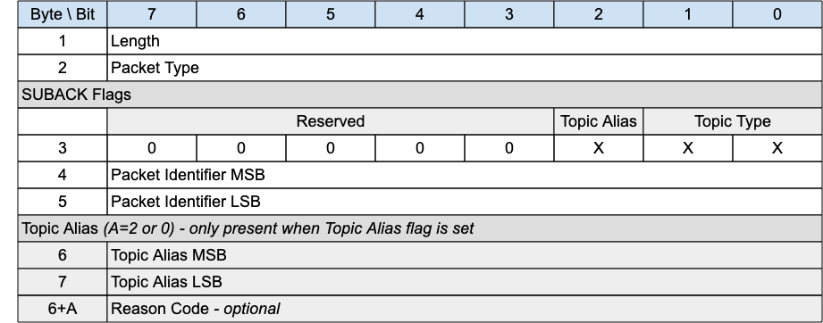

## SUBACK - Subscribe Acknowledgement{#suback---subscribe-acknowledgement}

*Figure 3-18 -- SUBACK Packet*

<!-- .width="6.5in", .height="2.5555555555555554in" -->

The SUBACK packet is sent by a Server to a client as an acknowledgment to the receipt and processing of a SUBSCRIBE packet.

### SUBACK Header{#suback-header}

The first 2 or 4 bytes of the packet are encoded according to the variable length packet header format. Refer to [sec](#structure-of-an-mqtt-sn-control-packet) for a detailed description.

### SUBACK Flags{#suback-flags}

The SUBACK Flags is a 1 byte field which contains flags specifying the contents of the SUBACK packet. «<mark title="Requirement MQTT-SN-3.8.2-1">Bits 7-3 of the SUBACK Flags are reserved and MUST be set to 0</mark>»\[MQTT‑SN‑3.8.2‑1].

«<mark title="Requirement MQTT-SN-3.8.2-2">The Client MUST validate that the reserved flags in the SUBACK packet are set to 0. If any of the reserved flags is not 0 it is a Malformed Packet</mark>»\[MQTT‑SN‑3.8.2‑2].

#### Topic Type{#ssa---topic-type}

**Position**: bits 0 and 1 of the SUBACK Flags.

Determines the format of the topic value. Refer to [[2.4 Topic Types]](#topic-types) for the definition of the various topic types.

«<mark title="Requirement MQTT-SN-3.8.2.1-1">The Topic Type in the SUBACK packet MUST be either Predefined Topic Alias or Session Topic Alias</mark>»\[MQTT‑SN‑3.8.2.1‑1].

«<mark title="Requirement MQTT-SN-3.8.2.1-2">If there is no Topic Alias returned the Topic Type MUST be Predefined Topic Alias</mark>»\[MQTT‑SN‑3.8.2.1‑2].

#### Topic Alias Flag{#ssa--topic-alias-flag}

**Position**: bit 2 of the SUBACK Flags.

«<mark title="Requirement MQTT-SN-3.8.2.1-1">If the Topic Alias Flag is set to 0, a Topic Alias MUST NOT be present in the Packet</mark>»\[MQTT‑SN‑3.8.2.1‑1].

«<mark title="Requirement MQTT-SN-3.8.2.1-2">If the Topic Alias Flag is set to 1, a Topic Alias MUST be present in the Packet</mark>»\[MQTT‑SN‑3.8.2.1‑2].

### Packet Identifier{#ssa---packet-identifier}

The same value as the Packet Identifier in the SUBSCRIBE Packet being acknowledged.

### Topic Alias{#ssa---topic-alias}

«<mark title="Requirement MQTT-SN-3.8.4-1">If a Topic Alias is returned, it MUST be used instead of the Topic Name by the Server when sending PUBLISH packets to the client</mark>»\[MQTT‑SN‑3.8.4‑1].

«<mark title="Requirement MQTT-SN-3.8.4-2">If no Topic Alias is returned, the Topic Alias Flag MUST be 0</mark>»\[MQTT‑SN‑3.8.4‑2]. This will be the case when subscribing to a Topic Filter containing wildcards, as Topic Aliases can only be applied to Topic Names.

«<mark title="Requirement MQTT-SN-3.8.4-3">If a Predefined Topic Alias was subscribed to, a Topic Alias MUST NOT be present in the SUBACK</mark>»\[MQTT‑SN‑3.8.4‑3].

### Reason Code{#ssa---reason-code}

The Reason Code for the SUBACK packet is optional - its existence is inferred from the Packet length. If not provided, 0x00 (Success) is assumed.

The values of Reason Codes are shown in «<mark title="Requirement MQTT-SN-3.8.5-1">[2.3 Reason Code]](#reason-code). [The sender of the SUBACK Packet MUST use one of the Reason Codes applicable to SUBACK</mark>»\[MQTT‑SN‑3.8.5‑1].
