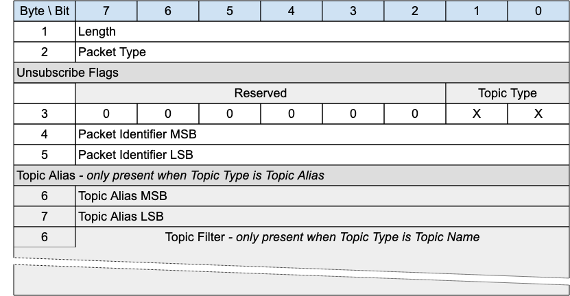

## UNSUBSCRIBE - Unsubscribe Request{#unsubscribe---unsubscribe-request}

*Figure 3-19 -- UNSUBSCRIBE Packet*

<!-- .width="6.5in", .height="3.375in" -->

An UNSUBSCRIBE packet is sent by the Client to the Server to remove subscriptions to topics.

### UNSUBSCRIBE Header{#unsubscribe-header}

The first 2 or 4 bytes of the packet are encoded according to the variable length packet header format. Refer to [[2.1 Structure of an MQTT-SN Control Packet]](#structure-of-an-mqtt-sn-control-packet) for a detailed description.

### UNSUBSCRIBE Flags{#unsubscribe-flags}

The UNSUBSCRIBE Flags is a 1 byte field which contains flags specifying the contents of the UNSUBSCRIBE packet. «<mark title="Requirement MQTT-SN-3.9.2-1">Bits 7-2 of the UNSUBSCRIBE Flags are reserved and MUST be set to 0</mark>»\[MQTT‑SN‑3.9.2‑1].

«<mark title="Requirement MQTT-SN-3.9.2-2">The Client MUST validate that the reserved flags in the UNSUBSCRIBE packet are set to 0. If any of the reserved flags is not 0 it is a Malformed Packet</mark>»\[MQTT‑SN‑3.9.2‑2].

#### Topic Type{#uur---topic-type}

**Position**: bits 0 and 1 of the UNSUBSCRIBE Flags.

Determines the existence of the Topic Alias or Topic Filter. Refer to [[2.4 Topic Types]](#topic-types) for the definition of the various topic types.

### Packet Identifier{#uur---packet-identifier}

Used to identify the corresponding UNSUBACK packet. It should ideally be populated with a random Two Byte Integer value.

### Topic Alias{#uur---topic-alias}

«<mark title="Requirement MQTT-SN-3.9.4-1">A Topic Alias MUST be present in the UNSUBSCRIBE packet if the Topic Type is Predefined or Session Topic Alias</mark>»\[MQTT‑SN‑3.9.4‑1].

«<mark title="Requirement MQTT-SN-3.9.4-2">A Topic Alias MUST NOT be present in the UNSUBSCRIBE packet if the Topic Type is Topic Name</mark>»\[MQTT‑SN‑3.9.4‑2].

Predefined or Session Topic Alias as indicated by the *Topic Type*. Determines the topic names which this subscription is interested in.

### Topic Filter{#uur---topic-filter}

«<mark title="Requirement MQTT-SN-3.9.5-1">A Topic Filter MUST be present in the UNSUBSCRIBE packet if the Topic Type is Topic Name</mark>»\[MQTT‑SN‑3.9.5‑1].

«<mark title="Requirement MQTT-SN-3.9.5-2">A Topic Filter MUST NOT be present in the UNSUBSCRIBE packet if the Topic Type is Predefined or Session Topic Alias</mark>»\[MQTT‑SN‑3.9.5‑2].

The Topic Filter is an UTF-8 Encoded String. The existence or absence of this field is inferred from the Packet length.

### UNSUBSCRIBE Actions{#unsubscribe-actions}

«<mark title="Requirement MQTT-SN-3.9.6-1">If a Topic Alias is used in an UNSUBSCRIBE request, it MUST be translated to its equivalent Topic Name before any other action takes place</mark>»\[MQTT‑SN‑3.9.6‑1].

«<mark title="Requirement MQTT-SN-3.9.6-2">The Topic Filter (whether it contains wildcards or not) supplied in an UNSUBSCRIBE packet MUST be compared character-by-character with the current set of Topic Filters held by the Server for the Client. If any filter matches exactly then its owning Subscription MUST be deleted</mark>»\[MQTT‑SN‑3.9.6‑2], otherwise no additional processing occurs.

<mark title="Ephemeral region marking">When a Server receives UNSUBSCRIBE</mark> :

- «<mark title="Requirement MQTT-SN-3.9.6-3">It MUST stop adding any new Application Messages which match the Topic Filters, for delivery to the Client</mark>»\[MQTT‑SN‑3.9.6‑3].

- «<mark title="Requirement MQTT-SN-3.9.6-4">It MUST complete the delivery of any QoS 1 or QoS 2 Application Messages which match the Topic Filters and it has started to send to the Client</mark>»\[MQTT‑SN‑3.9.6‑4].

- It MAY continue to deliver any existing Application Messages which match the Topic Filters buffered for delivery to the Client.

<mark title="Ephemeral region marking">The Server MUST respond to an UNSUBSCRIBE request by sending an UNSUBACK packet]{.mark} \[MQTT-3.9.6-5\]. [The UNSUBACK packet MUST have the same Packet Identifier as the UNSUBSCRIBE packet. Even where no Topic Subscriptions are deleted, the Server MUST respond with an UNSUBACK</mark> \[MQTT-3.9.6-6\].
