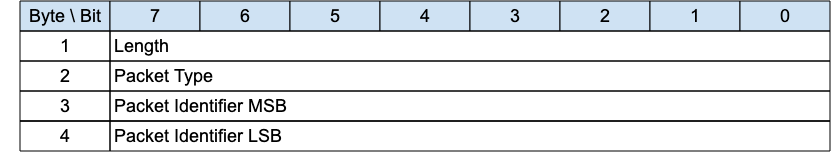

## PINGREQ - Ping Request{#pingreq---ping-request}

*Figure 3-21 -- PINGREQ Packet*

<!-- .width="6.5in", .height="1.1944444444444444in" -->

The PINGREQ packet is sent from a Client to the Server. It can be used to:

- Indicate to the Server that the Client is alive in the absence of any other MQTT-SN Control Packets being sent from the Client to the Server. For more information refer to [[3.1.6 Keep Alive]](#keep-alive).

- Request that the Server responds to confirm that it is alive and that it has a Virtual Connection for the Client.

- Exercise the network to determine whether communications are working.

- Inform the Server that the Client has awoken from being Asleep and is now waiting for any queued up Application Messages at the Server to be sent to it. For more information refer to [[4.14.2 Sleeping Clients]](#sleeping-clients).

### PINGREQ Header{#pingreq-header}

The first 2 or 4 bytes of the packet are encoded according to the variable length packet header format. Refer to [[2.1 Structure of an MQTT-SN Control Packet]](#structure-of-an-mqtt-sn-control-packet) for a detailed description.

### Packet Identifier{#ppreq---packet-identifier}

Used to identify the corresponding PINGRESP packet. It should ideally be set to a random Two Byte Integer value.

### PINGREQ Actions{#pingreq-actions}

«<mark title="Requirement MQTT-SN-3.11.3-1">The Server MUST send a PINGRESP packet in response to a PINGREQ packet if it has a Virtual Connection for the sending Client</mark>»\[MQTT‑SN‑3.11.3‑1].

«<mark title="Requirement MQTT-SN-3.11.3-2">The Server MAY send a DISCONNECT packet in response to a PINGREQ packet if it does not have a Virtual Connection for the sending Client</mark>»\[MQTT‑SN‑3.11.3‑2].

«<mark title="Requirement MQTT-SN-3.11.3-3">If the Server sends a DISCONNECT packet in response to a PINGREQ packet because it does not have a Virtual Connection for the sending Client, it MUST use Reason Code 244 - No Virtual Connection Exists</mark>»\[MQTT‑SN‑3.11.3‑3].

«<mark title="Requirement MQTT-SN-3.11.3-4">If the state of the Client associated with the Virtual Connection is Asleep on receipt of the PINGREQ, the Server MUST move the Client to the Awake state, stop the Sleep Duration processing, and start the Retry Timer processing</mark>»\[MQTT‑SN‑3.11.3‑4].
