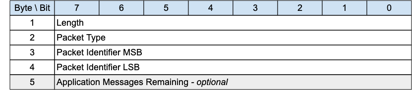

## PINGRESP - Ping Response{#pingresp---ping-response}

*Figure 3-22 -- PINGRESP Packet*

<!-- .width="6.5in", .height="1.4166666666666667in" -->

A PINGRESP Packet is sent by the Server to the Client in response to a PINGREQ packet. It indicates that the Server is alive.

This Packet is used in Keep Alive processing. Refer to [[3.1.6 Keep Alive]](#keep-alive) for more details.

A PINGRESP packet is also sent by the Server to inform a Client in the Awake state that it has no more buffered packets for that Client. See [[4.14.2 Sleeping Clients]](#sleeping-clients) for more information about sleeping Clients.

### PINGRESP Header{#pingresp-header}

The first 2 or 4 bytes of the packet are encoded according to the variable length packet header format. Refer to [sec](#structure-of-an-mqtt-sn-control-packet) for a detailed description.

### Packet Identifier{#ppres-packet-identifier}

The same value as the Packet Identifier in the PINGREQ Packet being acknowledged.

### Application Messages Remaining{#application-messages-remaining}

The number of Application Messages still queued for delivery at the Server when the PINGRESP is sent to send the Client back to sleep.

It is optional, intended as useful information for the Client - its existence is inferred from the Packet length. This field can be present in the Active state as well as the Awake state.

Values can be:

*Figure 3-23 -- PINGRESP continuation values*

| Allowed Values  | Description                                                                                     |
|:---------------:|-------------------------------------------------------------------------------------------------|
|        0        | No Application Messages are waiting to be delivered                                             |
| 1 – 254 (incl.) | The number of Application Messages waiting to be delivered                                      |
|   255 (0xFF)    | An unspecified positive number of Application Messages waiting to be delivered greater than 0\. |

Table: PINGRESP continuation values
