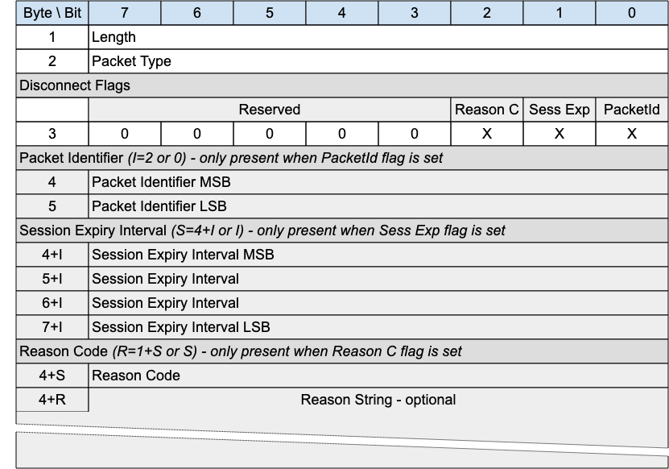

## DISCONNECT - Disconnect Notification{#disconnect---disconnect-notification}

*Figure 3-24 -- DISCONNECT Packet*

<!-- .width="6.5in", .height="4.555555555555555in" -->

The DISCONNECT packet is sent by a Client to indicate that it is going to delete the Virtual connection and go to the Disconnected state.

DISCONNECT may be sent by a Server to indicate that it cannot continue with the Virtual Connection and is deleting it - for instance the Server might be shutting down. It should use an appropriate and allowed Reason Code - 0x8B for Server shutting down, for instance.

A Client may receive an unsolicited DISCONNECT from a Server whether or not it has a Virtual Connection to that Server. This may happen for example when the Server, due to an error, cannot identify the Client to which a received packet belongs.

If a Client or Server receives a packet which requires a Virtual Connection (all packets except CONNECT, ADVERTISE, GWINFO, SEARCHGW and PUBWOS), and no Virtual Connection exists, it MAY send a DISCONNECT in response to the originator with Reason Code 0xF4 - No Virtual Connection exists.

### DISCONNECT Header{#disconnect-header}

The first 2 or 4 bytes of the packet are encoded according to the variable length packet header format. Refer to [sec](#structure-of-an-mqtt-sn-control-packet) for a detailed description.

### DISCONNECT Flags{#disconnect-flags}

The DISCONNECT Flags is a 1 byte field which contains flags specifying the contents of the DISCONNECT packet. «<mark title="Requirement MQTT-SN-3.13.2-1">Bits 7-3 of the DISCONNECT Flags are reserved and MUST be set to 0</mark>»\[MQTT‑SN‑3.13.2‑1].

«<mark title="Requirement MQTT-SN-3.13.2-2">The receiver MUST validate that the reserved flags in the DISCONNECT packet are set to 0. If any of the reserved flags is not 0 it is a Malformed Packet</mark>»\[MQTT‑SN‑3.13.2‑2].

#### Packet Identifier Flag{#packet-identifier-flag}

**Position:** bit 0 of the DISCONNECT Flags. Labelled *PacketId* in Figure 3-27.

​​«<mark title="Requirement MQTT-SN-3.13.2.1-1">If the Packet Identifier Flag is set to 0, a Packet Identifier MUST NOT be present in the Packet</mark>»\[MQTT‑SN‑3.13.2.1‑1].

«<mark title="Requirement MQTT-SN-3.13.2.1-2">If the Packet Identifier Flag is set to 1, a Packet Identifier MUST be present in the Packet</mark>»\[MQTT‑SN‑3.13.2.1‑2].

#### Session Expiry Interval Flag{#ddn---session-expiry-interval-flag}

**Position:** bit 1 of the DISCONNECT Flags. Labelled *Sess Exp* in Figure 3-27.

​​«<mark title="Requirement MQTT-SN-3.13.2.2-1">If the Session Expiry Interval Flag is set to 0, a Session Expiry Interval MUST NOT be present in the Packet</mark>»\[MQTT‑SN‑3.13.2.2‑1].

«<mark title="Requirement MQTT-SN-3.13.2.2-2">If the Session Expiry Interval Flag is set to 1, a Session Expiry Interval MUST be present in the Packet</mark>»\[MQTT‑SN‑3.13.2.2‑2].

#### Reason Code Flag{#reason-code-flag}

**Position:** bit 2 of the DISCONNECT Flags. Labelled *Reason C* in Figure 3-27.

​​«<mark title="Requirement MQTT-SN-3.13.2.3-1">If the Reason Code Flag is set to 0, a Reason Code MUST NOT be present in the Packet</mark>»\[MQTT‑SN‑3.13.2.3‑1].

«<mark title="Requirement MQTT-SN-3.13.2.3-2">If the Reason Code Flag is set to 1, a Reason Code MUST be present in the Packet</mark>»\[MQTT‑SN‑3.13.2.3‑2].

### Packet Identifier{#ddn---packet-identifier}

This field is optional. It can be used by a Server when responding to a Client packet for which there is no current Virtual Connection. In this case, the DISCONNECT packet can be sent by the Server, setting the Reason Code to 0xF4 (No Virtual Connection Exists) and including the Packet Identifier of the erroneous packet, to help with problem diagnosis.

### Reason Code{#ddn---reason-code}

The Reason Code for the DISCONNECT packet is optional. If not provided, 0x00 (Normal disconnection) is assumed.

The values for Reason Codes are shown in «<mark title="Requirement MQTT-SN-3.13.4-1">[sec](#reason-code). [The sender of the DISCONNECT packet MUST use one of the Reason Code values applicable to DISCONNECT</mark>»\[MQTT‑SN‑3.13.4‑1].

### Session Expiry Interval{#ddn---session-expiry-interval}

The Session Expiry Interval is a four-byte integer time interval measured in seconds. If the Session Expiry Interval is absent, the Session Expiry Interval in the CONNECT packet is used.

«<mark title="Requirement MQTT-SN-3.13.5-1">The Session Expiry Interval MUST NOT be sent on a DISCONNECT by the Server</mark>»\[MQTT-SN-3.13.5-1\].

If the Session Expiry Interval in the CONNECT packet was zero, then it is a Protocol Error to set a non-zero Session Expiry Interval in the DISCONNECT packet sent by the Client. If such a non-zero Session Expiry Interval is received by the Server, it does not treat it as a valid DISCONNECT packet. The Server uses DISCONNECT with Reason Code 0x82 (Protocol Error) as described in [sec](#handling-errors).

### Reason String{#reason-string}

Fixed Length UTF-8 Encoded String representing a clear text description of the reason for the disconnection.

This field is optional - its existence or absence is inferred from the Packet length.

### DISCONNECT Actions{#disconnect-actions}

<mark title="Ephemeral region marking">After sending a DISCONNECT packet the sender</mark>:

- «<mark title="Requirement MQTT-SN-3.13.7-1">MUST NOT send any more MQTT-SN Control Packets on that Virtual Connection</mark>»\[MQTT‑SN‑3.13.7‑1].

- «<mark title="Requirement MQTT-SN-3.13.7-2">MUST delete the Virtual Connection</mark>»\[MQTT‑SN‑3.13.7‑2].

<mark title="Ephemeral region marking">On receipt of DISCONNECT with a Reason Code of 0x00 (Success) the Server</mark>:

- «<mark title="Requirement MQTT-SN-3.13.7-3">MUST discard any Will Message associated with the current Connection without publishing it</mark>»\[MQTT‑SN‑3.13.7‑3], as described in [sec](#will-flags).

<mark title="Ephemeral region marking">On receipt of DISCONNECT, the receiver:</mark>

- «<mark title="Requirement MQTT-SN-3.13.7-4">MUST NOT send any more MQTT-SN Control Packets on the Virtual Connection, if one exists</mark>»\[MQTT‑SN‑3.13.7‑4].

- SHOULD delete any existing Virtual Connection.

After receiving a DISCONNECT, a Client can make a new Virtual Connection by sending a CONNECT Packet to the Server.
