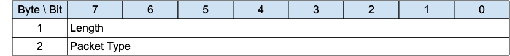

## WAKEUP - Wake up request{#wakeup---wake-up-request}

*Figure 3-25 -- WAKEUP Packet*

<!-- .width="6.5in", .height="0.7222222222222222in" -->

The wakeup packet is a signal sent from the Server to a client. It is an indication from the Server that the client should wake up. The client is not obliged to honor this request, nor may it even receive the packet. It can choose to ignore the request, or undertake one of the sequences outlined in [[4.14.2 Sleeping Clients]](#sleeping-clients). The client need not respond to this packet.

### WAKEUP Header{#wakeup-header}

The first 2 or 4 bytes of the packet are encoded according to the variable length packet header format. Refer to [sec](#structure-of-an-mqtt-sn-control-packet) for a detailed description.

### WAKEUP Actions{#wakeup-actions}

«<mark title="Requirement MQTT-SN-3.14.2-1">The Client MAY choose to follow the AWAKE procedure in response to receiving a WAKEUP packet</mark>»\[MQTT‑SN‑3.14.2‑1].
