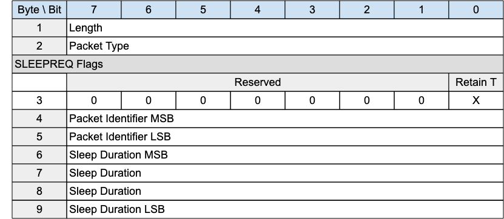

## SLEEPREQ - Sleep request{#sleepreq---sleep-request}

*Figure 3-26 -- SLEEPREQ Packet*

<!-- .width="6.5in", .height="2.8333333333333335in" -->

The SLEEPREQ packet is sent from the Client to the Server to indicate that it is going to sleep (moving to the Asleep state).

### SLEEPREQ Header{#sleepreq-header}

The first 2 or 4 bytes of the packet are encoded according to the variable length packet header format. Refer to [[2.1 Structure of an MQTT-SN Control Packet]](#structure-of-an-mqtt-sn-control-packet) for a detailed description.

### SLEEPREQ Flags{#sleepreq-flags}

The SLEEPREQ Flags is a 1 byte field which contains flags specifying the contents of the SLEEPREQ packet. «<mark title="Requirement MQTT-SN-3.15.2-1">Bits 7-1 of the SLEEPREQ Flags are reserved and MUST be set to 0</mark>»\[MQTT‑SN‑3.15.2‑1].

«<mark title="Requirement MQTT-SN-3.15.2-2">The receiver MUST validate that the reserved flags in the SLEEPREQ packet are set to 0. If any of the reserved flags is not 0 it is a Malformed Packet</mark>»\[MQTT‑SN‑3.15.2‑2].

#### Retain Topic Aliases{#retain-topic-aliases}

**Position:** bit 0 of the SLEEPREQ Flags. Labelled *Retain T* in Figure 3-28.

Specifies whether Session Topic Aliases should be retained by the Server during the Asleep state. "0" indicates Topic Aliases should be removed during the sleeping period and renegotiated when Awake or Active. "1" indicates Topic Aliases should be retained during the Asleep period, and therefore not negotiated when Awake or Active.

«<mark title="Requirement MQTT-SN-3.15.2.1-1">Predefined Topic aliases MUST NOT be removed by the setting of the Retain Topic Aliases flag to 1</mark>»\[MQTT‑SN‑3.15.2.1‑1].

### Packet Identifier{#ssreq---packet-identifier}

Used to identify the corresponding SLEEPRESP packet. It should ideally be set to a random Two Byte Integer value.

### Sleep Duration{#sleep-duration}

The Sleep Duration is a four-byte integer time interval measured in seconds. It is the maximum amount of time that a client may stay asleep without being disconnected by the Server. For more information on sleeping clients, and the purpose of Sleep Duration, see [[4.14.2 Sleeping Clients]](#sleeping-clients).

«<mark title="Requirement MQTT-SN-3.15.4-1">The Sleep Duration MUST be greater than 0</mark>»\[MQTT‑SN‑3.15.4‑1].

> **Informative Comment**
>
> The Sleep Duration should likely be substantially less than the Session Expiry for the session. If anything goes wrong in the Asleep to Awake transition, the Virtual Connection might be deleted by the Server, and the Session data might also be deleted if the Session Expiry interval passes before the Client reconnects.
>
> **Informative Comment**
>
> The Server can decide when to disconnect a sleeping Client it has not heard from. If packet loss is minimal, allowing 1.5 times the Sleep Duration before disconnecting the Client, similar to the Keep Alive processing, in many cases might be too short. Waiting 2.5 times the Sleep Duration before disconnecting the Client will allow one missed waking period.

### SLEEPREQ Actions{#sleepreq-actions}

«<mark title="Requirement MQTT-SN-3.15.5-1">A SLEEPREQ packet sent by a Server is a Protocol Error</mark>»\[MQTT‑SN‑3.15.5‑1].

«<mark title="Requirement MQTT-SN-3.15.5-2">If there is a Virtual Connection for the Client, the Server MUST send a SLEEPRESP packet in response to a SLEEPREQ packet</mark>»\[MQTT‑SN‑3.15.5‑2].

«<mark title="Requirement MQTT-SN-3.15.5-3">If there is no Virtual Connection associated with the SLEEPREQ, the Server MAY send a DISCONNECT with Reason Code xxx in response</mark>»\[MQTT‑SN‑3.15.5‑3].

«<mark title="Requirement MQTT-SN-3.15.5-4">If the SLEEPREQ request is granted, the Server MUST suspend Keep Alive processing for the Virtual Connection</mark>»\[MQTT‑SN‑3.15.5‑4].

«<mark title="Requirement MQTT-SN-3.15.5-5">If the SLEEPREQ request is granted, the Server MUST start Sleep Duration processing for the Virtual Connection</mark>»\[MQTT‑SN‑3.15.5‑5].

«<mark title="Requirement MQTT-SN-3.15.5-6">If the SLEEPREQ request is successful, the Virtual Connection MUST NOT be deleted</mark>»\[MQTT‑SN‑3.15.5‑6].

«<mark title="Requirement MQTT-SN-3.15.5-7">If the Client is already in the Asleep state when a SLEEPREQ is received by the Server, the Server MUST stop the Sleep Duration Timer, and start a new sleep cycle using the updated Sleep Duration</mark>»\[MQTT‑SN‑3.15.5‑7].

After sending a SLEEPREQ packet the Client MAY wait for a SLEEPRESP packet in response from the Server.

A Client will wait for a response if it wishes to ascertain that the Server has received and processed its sleep request. By doing so it will avoid the possibility of having to reestablish a Virtual Connection on wakening if the Server did not receive the SLEEPREQ and the Virtual Connection has been deleted by the Server because of a Keep Alive timeout.

A Client might not wait, or might stop waiting, if it is concerned that it will use excess power to determine that the Server has received the SLEEPREQ.
