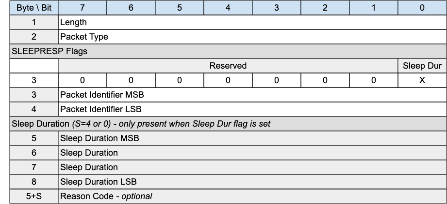

## SLEEPRESP - Sleep response{#sleepresp---sleep-response}

*Figure 3-27 -- SLEEPRESP Packet*

<!-- .width="6.5in", .height="2.9722222222222223in" -->

### SLEEPRESP Header{#sleepresp-header}

The first 2 or 4 bytes of the packet are encoded according to the variable length packet header format. Refer to [[2.1 Structure of an MQTT-SN Control Packet]](#structure-of-an-mqtt-sn-control-packet) for a detailed description.

### SLEEPRESP Flags{#sleepresp-flags}

The SLEEPRESP Flags is a 1 byte field which contains flags specifying the contents of the SLEEPRESP packet. «<mark title="Requirement MQTT-SN-3.16.2-1">Bits 7-1 of the SLEEPRESP Flags are reserved and MUST be set to 0</mark>»\[MQTT‑SN‑3.16.2‑1].

«<mark title="Requirement MQTT-SN-3.16.2-2">The receiver MUST validate that the reserved flags in the SLEEPRESP packet are set to 0. If any of the reserved flags is not 0 it is a Malformed Packet</mark>»\[MQTT‑SN‑3.16.2‑2].

#### Sleep Duration Flag{#sleep-duration-flag}

**Position:** bit 0 of the SLEEPRESP Flags. Labelled *Sleep Dur* in Figure 3-28.

​​«<mark title="Requirement MQTT-SN-3.16.2.1-1">If the Sleep Duration Flag is set to 0, Sleep Duration MUST NOT be present in the Packet</mark>»\[MQTT‑SN‑3.16.2.1‑1].

​​«<mark title="Requirement MQTT-SN-3.16.2.1-2">If the Sleep Duration Flag is set to 1, Sleep Duration MUST be present in the Packet</mark>»\[MQTT‑SN‑3.16.2.1‑2].

«<mark title="Requirement MQTT-SN-3.16.2.1-3">If the Allow Modified Sleep Duration Flag in the CONNECT Packet that created the current Virtual Connection was 0, the Server MUST set the Sleep Duration Flag in the SLEEPRESP Packet to 0</mark>»\[MQTT‑SN‑3.16.2.1‑3].

### Packet Identifier{#ssres---packet-identifier}

The same value as the Packet Identifier in the SLEEPREQ Packet being acknowledged.

### Sleep Duration{#ssres---sleep-duration}

The Server uses this field to inform the Client that it is using a value other than that sent by the Client in the SLEEPRESP.

«<mark title="Requirement MQTT-SN-3.16.3-1">If the Server sends a Sleep Duration on the SLEEPRESP packet, the Client MUST use this value instead of the Sleep Duration value the Client sent in the SLEEPREQ packet</mark>»\[MQTT‑SN‑3.16.3‑1].

«<mark title="Requirement MQTT-SN-3.16.3-2">If the Server does not send the Sleep Duration, the Server MUST use the Sleep Duration value set by the Client in the SLEEPREQ packet</mark>»\[MQTT‑SN‑3.16.3‑2].

Refer to [[4.14.2 Sleeping Clients]](#sleeping-clients) for more information on Sleeping Clients.

### Reason Code{#ssres---reason-code}

The Reason Code for the SLEEPRESP packet is optional - its existence is inferred from the Packet length. If not provided, 0x00 (Success) is assumed.

The values for Reason Codes are shown in «<mark title="Requirement MQTT-SN-3.16.4-1">[2.3 Reason Code]](#reason-code). [The sender of the SLEEPRESP packet MUST use one of the Reason Code values applicable to SLEEPRESP</mark>»\[MQTT‑SN‑3.16.4‑1].
