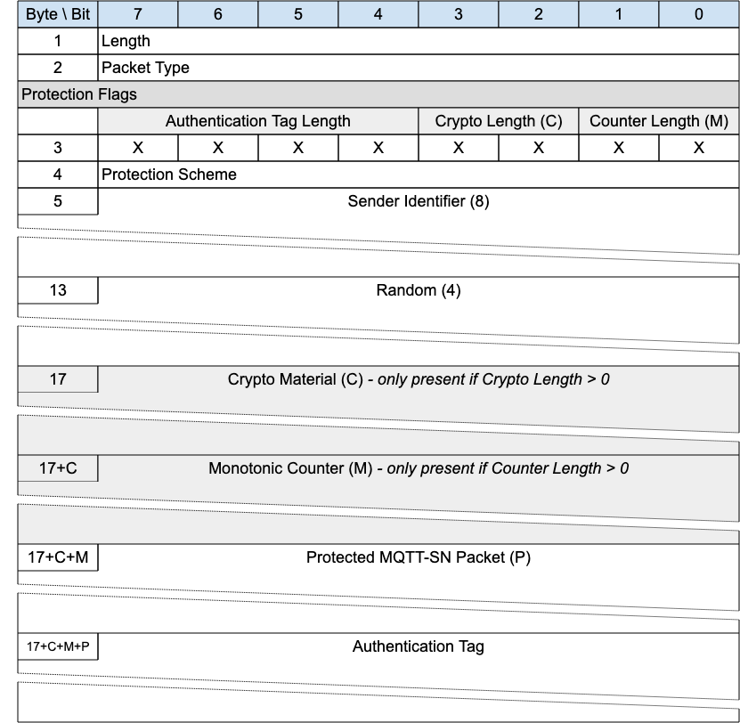

## Protection Encapsulation{#protection-encapsulation}

*Figure 3-28 -- Format of an Protection Encapsulated MQTT-SN Packet*

<!-- .width="6.5in", .height="6.347222222222222in" -->

Protection encapsulation provides a secure envelope for any MQTT-SN packet (with the exception of the Forward Encapsulation packet). The fields provided by the Protection Encapsulation provide a means by which the sender is identified and the packet is protected, using a number of prescribed protection schemes. Where the phrase "protected Packet" is used in this document, it means an MQTT-SN Packet surrounded by the Protection Encapsulation.

«<mark title="Requirement MQTT-SN-3.17-1">The sender identified by Sender Identifier is the originator of the protected MQTT-SN Packet and responsible for its protection. This responsibility MUST NOT be delegated to a third party like a Forwarder</mark>»\[MQTT‑SN‑3.17‑1].

The sender identification is required as the sender and the receiver of the protected packet must have access to the same shared key to be used directly or after derivation. The Sender Identifier may not be related to the Network Address of the sender. The authentication of the sender and the receiver, their authorizations and the provisioning of the shared keys used to protect integrity and optionally confidentiality of the protected packet content are out of scope.

A protected packet, like any other one, can be the payload of a Forwarder Encapsulated packet.

A Session that is created using a Protected CONNECT Packet is known as a protected Session. A Session that is created using a CONNECT Packet without Protection Encapsulation is known as an unprotected Session.

«<mark title="Requirement MQTT-SN-3.17-2">All Packets in all Virtual Connections associated with a protected Session MUST use the Protection Encapsulation</mark>»\[MQTT‑SN‑3.17‑2].

«<mark title="Requirement MQTT-SN-3.17-3">A protected Packet that has the same Client Identifier but a different Sender Identifier as an existing protected Session MUST refer to a different Session</mark>»\[MQTT‑SN‑3.17‑3].

«<mark title="Requirement MQTT-SN-3.17-4">A protected Packet that has the same Sender Identifier but a different Client Identifier as an existing protected Session MUST refer to a different Session</mark>»\[MQTT‑SN‑3.17‑4].

«<mark title="Requirement MQTT-SN-3.17-5">An unprotected Packet that has the same Client Identifier as an existing protected Session MUST refer to a different Session</mark>»\[MQTT‑SN‑3.17‑5].

> **Informative Comment**
>
> A way to satisfy these constraints is to index the Session by Sender Identifier and Client Identifier combined, instead of just Client Identifier.
>
> **Informative Comment**
>
> If the Client and Server cannot communicate using protected Packets and the Client and Server are not in a private network, it is recommended that the Server processes only MQTT-SN packets received over a secured Network Connection (DTLS for example) initiated with mutual authentication by the Client.
>
> **Informative Comment**
>
> If the Client and Server cannot communicate using protected Packets and the Client and Server are not in a private network, it is recommended that the Client create a secured Network Connection (DTLS for example) and process only MQTT-SN packets received over it.

### Protection Encapsulation Header{#protection-encapsulation-header}

The first 2 or 4 bytes of the packet are encoded according to the variable length packet header format. Refer to section  [sec](#structure-of-an-mqtt-sn-control-packet) for a detailed description.

### Protection Flags{#protection-flags}

The Protection Flags is a one byte field specifying the properties of the Protection Encapsulation.

#### Monotonic Counter Length{#monotonic-counter-length}

**Position:** bits 0 and 1 of the Protection Flags. Labelled *Counter Length* in Figure 3-28.

Specifies the number of bytes forming the monotonic counter in big-endian order. Only three of the four possible values are allowed.

- «<mark title="Requirement MQTT-SN-3.17.2.1-1">The Monotonic Counter Length MUST NOT be set to 0x3 - the value is reserved</mark>»\[MQTT‑SN‑3.17.2.1‑1].

- «<mark title="Requirement MQTT-SN-3.17.2.1-2">If the Monotonic Counter Length is set to 0x2, a Monotonic Counter of 32 bits (4 bytes) in length MUST be present in the Protection Encapsulation</mark>»\[MQTT‑SN‑3.17.2.1‑2].

- «<mark title="Requirement MQTT-SN-3.17.2.1-3">If the Monotonic Counter Length is set to 0x1, a Monotonic Counter of 16 bits (2 bytes) in length MUST be present in the Protection Encapsulation</mark>»\[MQTT‑SN‑3.17.2.1‑3].

- «<mark title="Requirement MQTT-SN-3.17.2.1-4">If the Monotonic Counter Length is set to 0x0, a Monotonic Counter MUST NOT be present in the Protection Encapsulation</mark>»\[MQTT‑SN‑3.17.2.1‑4].

#### Cryptographic Material Length{#cryptographic-material-length}

**Position:** bits 2 and 3 of the Protection Flags. Labelled *Crypto Length* in Figure 3-28.

Specifies the number of sixteen bit groups forming the cryptographic material in big-endian order. The meaning of each possible value is defined as follows.

- «<mark title="Requirement MQTT-SN-3.17.2.2-1">If the Cryptographic Material Length is set to 0x3, a Cryptographic Material field of 96 bits (12 bytes) in length MUST be present in the Protection Encapsulation</mark>»\[MQTT‑SN‑3.17.2.2‑1].

- «<mark title="Requirement MQTT-SN-3.17.2.2-2">If the Cryptographic Material Length is set to 0x2, a Cryptographic Material field of 32 bits (4 bytes) in length MUST be present in the Protection Encapsulation</mark>»\[MQTT‑SN‑3.17.2.2‑2].

- «<mark title="Requirement MQTT-SN-3.17.2.2-3">If the Cryptographic Material Length is set to 0x1, a Cryptographic Material field of 16 bits (2 bytes) in length MUST be present in the Protection Encapsulation</mark>»\[MQTT‑SN‑3.17.2.2‑3].

- «<mark title="Requirement MQTT-SN-3.17.2.2-4">If the Cryptographic Material Length is set to 0x0, a Cryptographic Material field MUST NOT be present in the Protection Encapsulation</mark>»\[MQTT‑SN‑3.17.2.2‑4].

#### Authentication Tag Length{#authentication-tag-length}

**Position:** bits 4 through 7 of the Protection Flags.

The Authentication Tag Length defines the size of the Authentication Tag.

- Only fourteen of the sixteen possible values are allowed.

  - If the Authentication Tag Length is set to 0x0, the length of the Authentication Tag is provider defined.

> **Informative Comment**
>
> For instance a provider can decide that the length of the Authentication Tag field is 40 bits whenever the Authentication Tag Length field is 0x0. This will work only for devices running code which implements the same provider scheme as the Gateway.

- «<mark title="Requirement MQTT-SN-3.17.2.3-1">If the Protection Scheme is not "Authentication Only" the Authentication Tag Length MUST be set to 0x1</mark>»\[MQTT‑SN‑3.17.2.3‑1].

- «<mark title="Requirement MQTT-SN-3.17.2.3-2">If the Authentication Tag Length is set to 0x1, the length of the Authentication Tag MUST be equal to the Protection Scheme nominal tag size</mark>»\[MQTT‑SN‑3.17.2.3‑2].

- «<mark title="Requirement MQTT-SN-3.17.2.3-3">The Authentication Tag Length MUST NOT be set to 0x2 or 0x3 - these values are reserved</mark>»\[MQTT‑SN‑3.17.2.3‑3].

- «<mark title="Requirement MQTT-SN-3.17.2.3-4">If the Authentication Tag Length is set to any value between 0x4 and 0xF inclusive, the Protection Scheme MUST be "Authentication Only"</mark>»\[MQTT‑SN‑3.17.2.3‑4].

- «<mark title="Requirement MQTT-SN-3.17.2.3-6">Authentication Tag Length values between 0x4 and 0xF inclusive MUST only be used for the truncation of "Authentication Only" protection schemes]{.mark} \[MQTT-SN-3.17.2.3-5\]. [In these cases the length of the Authentication Tag MUST be sixteen times the Authentication Tag Length</mark>»\[MQTT‑SN‑3.17.2.3‑6]. For example:

  - if the value is 0xF, the length of the Authentication Tag will be (0xF)\*16=240 bits;

  - if the value is 0x4, the length of the Authentication Tag will be (0x4)\*16=64 bits.

- «<mark title="Requirement MQTT-SN-3.17.2.3-7">If truncation of the output of the authentication algorithm is required, it MUST be taken in most significant bits first order (leftmost bits)</mark>»\[MQTT‑SN‑3.17.2.3‑7].

- «<mark title="Requirement MQTT-SN-3.17.2.3-8">Authentication Tag Length values for some Authentication Only protection schemes MUST NOT be used if they define a tag size bigger than the nominal tag size</mark>»\<mark title="Ephemeral region marking">MQTT-SN-3.17.2.3-8][.</mark> For example, values from 0x09 (144 bits) to 0x0F (240 bits) are not allowed for "Authentication Only" protection schemes with a nominal tag size less than 144 bits, such as CMAC-128, CMAC-192, CMAC-256.

### Protection Scheme{#protection-scheme}

«<mark title="Requirement MQTT-SN-3.17.3-1">The Protection Scheme is a one byte field which MUST contain one of the indexes in table 3-39 which is not reserved</mark>»\[MQTT‑SN‑3.17.3‑1].

In general two types of protection scheme are considered: **Authentication only** (such as HMAC or CMAC) and **AEAD** (Authenticated Encryption with Associated Data, such as GCM, CCM or ChaCha20/Poly1305).

«<mark title="Requirement MQTT-SN-3.17.3-2">The thirteen byte nonce recommended for AES CCM must be obtained by performing SHA256, truncated to the leftmost 104 bits, of the sequence Byte 1 to Byte 17+C+M (all packet fields up to the Protected MQTT-SN Packet)</mark>»\[MQTT‑SN‑3.17.3‑2].

«<mark title="Requirement MQTT-SN-3.17.3-3">The twelve byte initialization vector (IV) recommended for AES GCM must be obtained by performing SHA256, truncated to the leftmost 96 bits, of the sequence Byte 1 to Byte 17+C+M (all packet fields up to the Protected MQTT-SN Packet)</mark>»\[MQTT‑SN‑3.17.3‑3].

«<mark title="Requirement MQTT-SN-3.17.3-4">The twelve byte nonce recommended for ChaCha20/Poly1305 must be obtained by performing SHA256 truncated to 96 bit of the sequence Byte 1 to Byte 17+C+M (all packet fields up to the Protected MQTT-SN Packet)</mark>»\[MQTT‑SN‑3.17.3‑4].

*Figure 3-29 -- Protection Schemes*

| Index     | Name                          |Authentication Only  | Key Size           | Nominal Tag Size |
|:----------|:------------------------------|:-------------------:|:-------------------|:-----------------|
| 0x00      | HMAC-SHA256 (Note 1\)         |         Yes         | Any size (Note 2\) | 256 bits         |
| 0x01      | HMAC-SHA3\_256 (Note 1\)      |         Yes         | Any size (Note 2\) | 256 bits         |
| 0x02      | CMAC-128 (Note 3\)            |         Yes         | 128 bits           | 128 bits         |
| 0x03      | CMAC-192 (Note 3\)            |         Yes         | 192 bits           | 128 bits         |
| 0x04      | CMAC-256 (Note 3\)            |         Yes         | 256 bits           | 128 bits         |
| 0x05-0x3B | RESERVED                      |                     |                    |                  |
| 0x3C-0x3F | Provider defined              |         Yes         | Provider defined   | Provider defined |
| 0x40      | AES-CCM-64-128 (Notes 4,5)    |         No          | 128 bits           | 64 bits          |
| 0x41      | AES-CCM-64-192 (Notes 4,5)    |         No          | 192 bits           | 64 bits          |
| 0x42      | AES-CCM-64-256 (Notes 4,5)    |         No          | 256 bits           | 64 bits          |
| 0x43      | AES-CCM-128-128 (Notes 4,5)   |         No          | 128 bits           | 128 bits         |
| 0x44      | AES-CCM-128-192 (Notes 4,5)   |         No          | 192 bits           | 128 bits         |
| 0x45      | AES-CCM-128-256 (Notes 4,5)   |         No          | 256 bits           | 128 bits         |
| 0x46      | AES-GCM-128-128 (Notes 6,7)   |         No          | 128 bits           | 128 bits         |
| 0x47      | AES-GCM-128-192 (Notes 6,7)   |         No          | 192 bits           | 128 bits         |
| 0x48      | AES-GCM-128-256 (Notes 6,7)   |         No          | 256 bits           | 128 bits         |
| 0x49      | ChaCha20/Poly1305 (Notes 8,9) |         No          | 256 bits           | 128 bits         |
| 0x4A-0xEF | RESERVED                      |                     |                    |                  |
| 0xF0-0xFF | Provider defined              |         No          | Provider defined   | Provider defined |

Table: Protection Schemes

**Note(s):**

> 1.  Reference <https://www.rfc-editor.org/rfc/rfc2104)

2.  Reference <https://nvlpubs.nist.gov/nistpubs/FIPS/NIST.FIPS.198-1.pdf>

3.  Reference <https://www.rfc-editor.org/rfc/rfc4493> and <https://nvlpubs.nist.gov/nistpubs/SpecialPublications/NIST.SP.800-38b.pdf> and <https://csrc.nist.gov/CSRC/images/Projects/Cryptographic-Standards-and-Guidelines/documents/examples/AES_CMAC.pdf>

4.  Reference <https://www.rfc-editor.org/rfc/rfc3610> and security considerations on <https://www.rfc-editor.org/rfc/rfc8152#section-10.2.1>

5.  AES CCM requires a 13 bytes nonce as indicated in <https://www.rfc-editor.org/rfc/rfc8152#section-10.2>

6.  Reference <https://nvlpubs.nist.gov/nistpubs/Legacy/SP/nistspecialpublication800-38d.pdf> and security considerations on <https://www.rfc-editor.org/rfc/rfc8152#section-10.1.1>

7.  AES GCM requires a 12 bytes IV as indicated in <https://www.rfc-editor.org/rfc/rfc8152#section-10.1>

8.  Reference: <https://www.rfc-editor.org/rfc/rfc7539> and security considerations on <https://www.rfc-editor.org/rfc/rfc8152#section-10.3.1>

9.  ChaCha20/Poly1305 requires a 12 bytes nonce as indicated in <https://www.rfc-editor.org/rfc/rfc8152#section-10.3>

### Sender Identifier{#sender-identifier}

«<mark title="Requirement MQTT-SN-3.17.4-1">The eight byte Sender Identifier field MUST contain a unique value per sender over 8 bytes (such as a MAC address, or other identifying characteristics)</mark>»\[MQTT‑SN‑3.17.4‑1]. The methods to guarantee the uniqueness of the Sender Identifier are out of scope.

> **Informative comment**
>
> In order to create a whitelist of authorized senders, the Client can store a map of authorized Servers. The Sender Identifiers of the authorized Servers can be obtained from pre-configuration, for example.
>
> **Informative comment**
>
> In order to create a whitelist of authorized senders, the MQTT-SN Server can store a map of authorized Clients. The Sender Identifiers of the authorized Clients can be obtained from pre-configuration, for example.

### Random{#random}

The four byte Random field should contain a random number which is not guessable, generated at the time of Protection Encapsulation packet creation.

> **Informative comment**
> 
> In the case of CCM, in the worst case scenario where the "Cryptographic Material" and the "Monotonic Counter" optional fields are not present, the recommended nonce on 13 bytes has to be calculated as SHA256 truncated to 104 bits of the sequence Byte 1 to Byte 16 (all packet fields up to the Protected MQTT-SN Packet). So considering the same Sender Identifier, the same nonce can be generated with a probability of 1/2\^32=2.33x10^-10^. With a shorter Random field of 2 bytes, the same nonce would be calculated with a probability of only 1/2\^16=1.53x10^-5^. As CCM is a derivation of CTR (see <https://en.wikipedia.org/wiki/CCM_mode>, the nonce should never be reused for the same key so the probability of generating two identical nonces should be kept as low as possible. The same applies to GCM and ChaCha20/Poly1305, the security depends on choosing a unique IV of 12 bytes for every encryption performed with the same key (<https://en.wikipedia.org/wiki/Galois/Counter_Mode]](https://en.wikipedia.org/wiki/Galois/Counter_Mode>).

### Cryptographic Material{#cryptographic-material}

The optional Cryptographic Material field contains two<mark title="Ephemeral region marking">, four or t]{.mark}welve [bytes of cryptographic material that when defined it can be used to derive, from a shared master secret, the same keys on the two endpoints and/or, when filled partially or totally with a random value, to provide enough entro]{.mark}py to [further reduce the probability of IV or nonce reuse for CCM or GCM or ChaCha20/Poly1305. For instance, when the Cryptographic Material Length is set to 0x03, the Cryptographic Material field can be partially filled with a random value of ni]{.mark}ne [bytes (the remaining th]{.mark}ree [bytes can be set to 0 if not used) in order to reach, in]{.mark} conjunction [with the]{.mark} four [bytes of the Random field, the]{.mark} thirteen [bytes of entropy recommended for the determination of the nonce used by CCM or it can be partially filled with a random value of eight bytes in order to reach the]{.mark} twelve [bytes of entro]{.mark}py [recommended for the IV or nonce used by GCM or ChaCha20/Poly1305.</mark>

### Monotonic Counter{#monotonic-counter}

The optional Monotonic Counter field contains a two «<mark title="Requirement MQTT-SN-3.17.7-1">or 4 four number that when defined, is increased by the Client or]{.mark} Server <mark title="Ephemeral region marking">for every packet sent. The counters must be considered independent of session or destination</mark>»\[MQTT‑SN‑3.17.7‑1]. For example, t[he]{.mark} Client [will keep a counter independently from the]{.mark} Server[.</mark>

### Protected MQTT-SN Packet{#protected-mqtt-sn-packet}

The field Protected MQTT-SN Packet contains the MQTT-SN packet that is being secured, encoded according to its packet type.

«<mark title="Requirement MQTT-SN-3.17.8-1">The Protected MQTT-SN Packet MUST NOT be a Forwarder Encapsulated Packet</mark>»\<mark title="Ephemeral region marking">MQTT-SN-3.17.8-1] [</mark>as the shared key used directly or after derivation for the protection must belong to the originator of the content and not to a Forwarder that, in general, is not able to securely identify the originator.

### Authentication Tag{#authentication-tag}

The Authentication Tag field has a length that depends on the Authentication Tag Length. Its content authenticates ALL the preceding fields and is obtained on the basis of the protection scheme selected in the Protection Scheme field.
