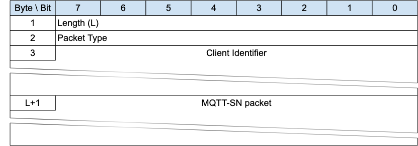

## Connection Encapsulation{#connection-encapsulation}

*Figure 3-30 -- Format of a Connection Encapsulated MQTT-SN Packet*

<!-- .width="6.5in", .height="2.2777777777777777in" -->

This envelope wraps an MQTT-SN Packet to allow it to be associated with an existing Virtual Connection where other methods are not sufficient. Only Clients can use the Connection Encapsulation because it is assumed that the Network Address for the Server is static for the duration of the Virtual Connection. If the Server Network Address is not static, then another method of identifying the Packet sender must be used, such as the Protection Encapsulation or DTLS.

«<mark title="Requirement MQTT-SN-3.18-1">If the Allow Network Identifier Changes flag in the CONNECT for the Virtual Connection is 0, it is a protocol error to use the Connection Encapsulation</mark>»\[MQTT‑SN‑3.18‑1].

«<mark title="Requirement MQTT-SN-3.18-2">It is a protocol error to use the Connection Encapsulation on Packets sent by a Server</mark>»\[MQTT-SN-3.18-2\].

«<mark title="Requirement MQTT-SN-3.18-3">It is a protocol error to use the Connection Encapsulation on Packets other than PUBLISH, SUBSCRIBE, UNSUBSCRIBE, REGISTER, DISCONNECT, SLEEPREQ and PINGREQ sent by a Client</mark>»\[MQTT-SN-3.18-3\].

«<mark title="Requirement MQTT-SN-3.18-4">The encapsulated MQTT-SN packet MUST be treated by the receiver in exactly the same fashion as the same Packet unencapsulated, once the associated Virtual Connection is identified</mark>»\[MQTT-SN-3.18-4\].

> **Informative Comment**
>
> If the Server receives a Connection Encapsulated Packet from a Network Address corresponding to an existing Virtual Connection, but the Connection Information does not match, this would normally be an error, but it is up to the implementation to decide.
>
> **Informative Comment**
>
> The Protection Encapsulation is a secure method of identifying the Sender but requires the prior distribution of shared secrets. The Connection Encapsulation is inherently insecure and should not be used to bypass the security of the connection process -- other environmental or network characteristics should be used in addition.

### Connection Encapsulation Header{#connection-encapsulation-header}

The first 2 or 4 bytes of the packet are encoded according to the variable length packet header format. Refer to [sec](#structure-of-an-mqtt-sn-control-packet) for a detailed description.

The Length field specifies the number of bytes up to the end of the Client Identifier field, including the Length field itself.

### Client Identifier{#ce---client-identifier}

This is a variable length UTF-8 field that contains the Client Identifier which was used to create the Virtual Connection.

### MQTT-SN Packet{#mqtt-sn-packet}

The MQTT-SN packet, encoded according to the packet type, follows immediately after the Client Identifier field.

