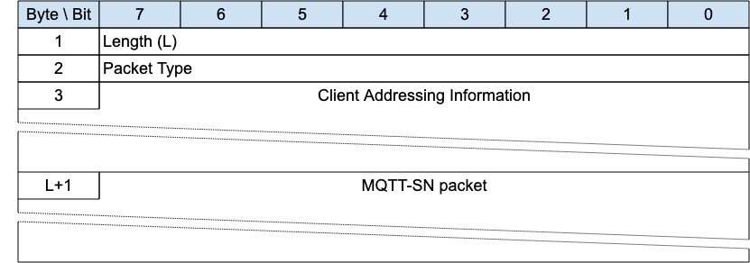

## Forwarder Encapsulation{#forwarder-encapsulation}

*Figure 3-31 -- Format of an Forwarder Encapsulated MQTT-SN Packet*

<!-- .width="6.5in", .height="2.2777777777777777in" -->

An MQTT-SN Client can access a Server through a Forwarder in case the Server is not directly attached to the same Underlying Network as the Client. The Forwarder encapsulates the MQTT-SN Packets it receives from the Client and sends them unchanged to the Server. In the opposite direction, it decapsulates the Packets it receives from the Server and sends them unchanged to the Clients.

The Forwarder Encapsulation contains the addressing information needed by the Forwarder to allow MQTT-SN Packets reach their intended destination(s). Refer to [sec](#c.1.3-forwarder) for examples.

### Forwarder Encapsulation Header{#forwarder-encapsulation-header}

The first 2 or 4 bytes of the packet are encoded according to the variable length packet header format. Refer to [sec](#structure-of-an-mqtt-sn-control-packet) for a detailed description.

The Length field specifies the number of bytes up to the end of the Client Addressing Information field, including the Length field itself.

### Client Addressing Information{#client-addressing-information}

Identifies the MQTT-SN Client which has sent or should receive the encapsulated MQTT-SN packet. The receiving Gateway can pass this information back to the Forwarder in the MQTT-SN response packet encapsulation, to allow the Forwarder to send packets to the appropriate destination.

The mapping between this information and the address of the sending or receiving Client node is implemented by the Forwarder, if needed. It can contain any other information needed to allow the packets to reach the correct destination.

> **Informative Comment**
>
> For example, in MQTT-SN 1.2 this field contained a wireless node identifier, which mapped to the Network Address, and a broadcast radius for use in ZigBee networks.

### MQTT-SN Packet{#fe---mqtt-sn-packet}

The MQTT-SN packet, encoded according to the packet type.
