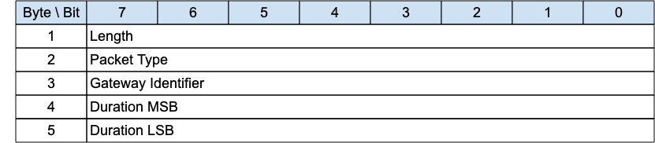
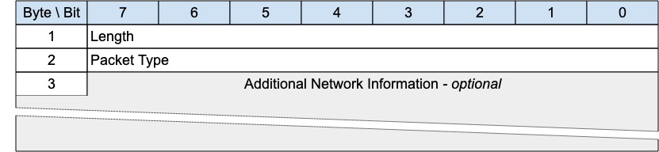
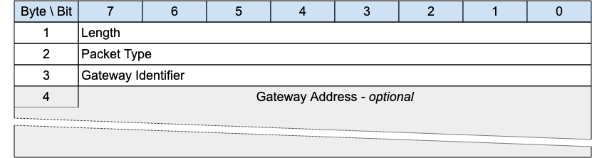

## Gateway Discovery Packets{#gateway-discovery-packets}

The Packets in this section are optional. A description of how this functionality works can be found in [[C.2 Gateway Advertisement and Discovery]](#c.7-gateway-advertisement-and-discovery).

### ADVERTISE - Gateway Advertisement{#advertise---gateway-advertisement}

*Figure 3-32 -- ADVERTISE Packet*

<!-- .width="6.5in", .height="1.4166666666666667in" -->

The ADVERTISE packet is sent periodically by a Gateway to advertise its presence. The time interval until the next transmission is indicated by the *Duration* field.

> **Informative comment**
>
> If the Transport Layer supports multicast, like UDP/IP, the ADVERTISE packet can be sent using a multicast address as the destination.

#### ADVERTISE Header{#advertise-header}

The first 2 or 4 bytes of the packet are encoded according to the variable length packet header format. Refer to [[2.1 Structure of an MQTT-SN Control Packet]](#structure-of-an-mqtt-sn-control-packet) for a detailed description.

#### Gateway Identifier{#gateway-identifier}

The *Gateway Identifier* field is 1 byte and uniquely identifies a Gateway which is advertising its presence on the network.

The MQTT-SN protocol itself does not guarantee the uniqueness of the *Gateway Identifier*.

#### Duration{#duration}

The *Duration* field is a 2-byte integer. It specifies the time interval in seconds until the next ADVERTISE packet is transmitted by this Gateway.

The maximum value that can be encoded is approximately 18 hours.

### SEARCHGW - Search for A Gateway{#searchgw---search-for-a-gateway}

*Figure 3-33 -- SEARCHGW Packet*

<!-- .width="6.5in", .height="1.5in" -->

The SEARCHGW packet is sent by a Client to find a Gateway to send Application Messages to, and receive Application Messages from.

> **Informative comment**
>
> If the Transport Layer supports multicast, like UDP/IP, the SEARCHGW packet can be sent using the multicast address as the destination.
>
> To prevent flooding the network, the transmission radius of the SEARCHGW packet may be limited, if the underlying Transport Layer supports the concept.

#### SEARCHGW Header{#searchgw-header}

The first 2 or 4 bytes of the packet are encoded according to the variable length packet header format. Refer to [[2.1 Structure of an MQTT-SN Control Packet]](#structure-of-an-mqtt-sn-control-packet) for a detailed description.

#### Additional Network Information{#additional-network-information}

Any extra information that the underlying network needs to control the search process can be included in this variable length field. It will be available to the receiver of this packet and could be used to affect the transmission of the GWINFO response packet.

This field is optional - its existence or absence is inferred from the Packet length.

> **Informative Comment**
>
> In ZigBee mesh networks, this field could contain the ZigBee 1-byte broadcast radius, for instance.

### GWINFO - Gateway Information{#gwinfo---gateway-information}

*Figure 3-34 -- GWINFO Packet*

<!-- .width="6.5in", .height="1.7361111111111112in" -->

The GWINFO packet is sent as response to a SEARCHGW packet. If sent by a Gateway, it contains only the identifier of the sending Gateway; otherwise, if sent by a client, it also includes the Network Address of the Gateway.

> **Informative comment**
>
> If the Transport Layer supports multicast, like UDP/IP, the GWINFO packet can be sent using a multicast address as destination.

#### GWINFO Header{#gwinfo-header}

The first 2 or 4 bytes of the packet are encoded according to the variable length packet header format. Refer to [[2.1 Structure of an MQTT-SN Control Packet]](#structure-of-an-mqtt-sn-control-packet) for a detailed description.

#### Gateway Identifier{#gwinfo---gateway-identifier}

The *Gateway Identifier* field is 1-byte long and uniquely identifies a Gateway in the network.

#### Gateway Address{#gateway-address}

The *Gateway Address* field has a variable length and contains the Network Address of a Gateway. Its length depends on the type of network over which MQTT-SN operates and is specified by the Length byte.

This field is optional - its existence or absence is inferred from the Packet length. It is only included if the Packet is sent by a Client.
