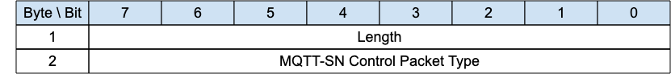
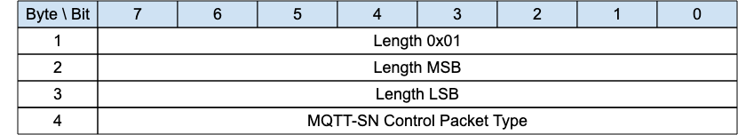

## Structure of an MQTT-SN Control Packet{#structure-of-an-mqtt-sn-control-packet}

The MQTT-SN protocol operates by exchanging a series of MQTT-SN Control Packets in a defined way. This section describes the format of these packets.

An MQTT-SN Control Packet consists of up to two parts, always in the following order as shown below.

*Figure 2-1 －Structure of an MQTT-SN Control Packet*

  -----------------------------------------------------------------------------------------------------------------------------------------------------
  Control Packet Header, present in all MQTT-SN Control Packets
  -----------------------------------------------------------------------------------------------------------------------------------------------------
  Control Packet Variable Part, present in some MQTT-SN Control Packets

  -----------------------------------------------------------------------------------------------------------------------------------------------------

Table: Structure of an MQTT-SN Control Packet

### Packet Header{#packet-header}

Each MQTT-SN Control Packet contains a Header of format 1 or format 2 as shown below.

*Figure 2-2 -- Packet Header Format 1*

<!-- .width="6.5in", .height="0.7222222222222222in" -->

*Figure 2-3 -- Packet Header Format 2*

<!-- .width="6.5in", .height="1.1944444444444444in" -->

### Length{#length}

The *Length* field is either 1-byte or 3-byte integer and specifies the total number of bytes contained in the packet (including the *Length* field itself).

If the first byte of the *Length* field is coded "0x01" then the *Length* field is 3-bytes long; in this case, the two following bytes specify the total number of bytes of the packet (most-significant byte first). Otherwise, the *Length* field is only 1-byte long and specifies itself the total number of bytes contained in the packet.

The 3-byte format allows the encoding of packet lengths up to 65,535 bytes. It is more efficient to use the shorter 1-byte format for packets with lengths up to and including 255 bytes.

«<mark title="Requirement MQTT-SN-2.1.2-1">A Client or Server receiving MQTT-SN control packets MUST be able to process both 1-byte and 3-byte length formats</mark>»\[MQTT‑SN‑2.1.2‑1].

**Informative comment**

> MQTT-SN does not support packet fragmentation and reassembly, the maximum packet length that could be used in a network is governed by the maximum packet size that is supported by that network, and not by the maximum length that could be encoded by MQTT-SN.

### MQTT-SN Control Packet Type{#mqtt-sn-control-packet-type}

The MQTT-SN Control Packet Type field is a 1-byte unsigned value, the values are shown below.

*Figure 2-4 -- MQTT-SN Control Packet Types*

|             Name             |   Value   |             Direction of flow              | Description                                                                                                               |
|:----------------------------:|:---------:|:------------------------------------------:|---------------------------------------------------------------------------------------------------------------------------|
|         **Reserved**         |   0x00    |                 Forbidden                  | Reserved                                                                                                                  |
|         **CONNECT**          |   0x01    |              Client to Server              | Virtual Connection request                                                                                                |
|         **CONNACK**          |   0x02    |              Server to Client              | Virtual Connection acknowledgement                                                                                        |
|         **PUBLISH**          |   0x03    |    Client to Server or Server to Client    | Publish message                                                                                                           |
|          **PUBACK**          |   0x04    |    Client to Server or Server to Client    | Publish acknowledgment (QoS 1\) or Publish error (Any QoS).                                                               |
|          **PUBREC**          |   0x05    |    Client to Server or Server to Client    | Publish received (QoS 2 delivery part 1\)                                                                                 |
|          **PUBREL**          |   0x06    |    Client to Server or Server to Client    | Publish release (QoS 2 delivery part 2\)                                                                                  |
|         **PUBCOMP**          |   0x07    |    Client to Server or Server to Client    | Publish complete (QoS 2 delivery part 3\)                                                                                 |
|        **SUBSCRIBE**         |   0x08    |              Client to Server              | Subscribe request                                                                                                         |
|          **SUBACK**          |   0x09    |              Server to Client              | Subscribe acknowledgment                                                                                                  |
|       **UNSUBSCRIBE**        |   0x0A    |              Client to Server              | Unsubscribe request                                                                                                       |
|         **UNSUBACK**         |   0x0B    |              Server to Client              | Unsubscribe acknowledgment                                                                                                |
|         **PINGREQ**          |   0x0C    |              Client to Server              | PING request                                                                                                              |
|         **PINGRESP**         |   0x0D    |              Server to Client              | PING response                                                                                                             |
|        **DISCONNECT**        |   0x0E    |    Client to Server or Server to Client    | Disconnect notification                                                                                                   |
|           **AUTH**           |   0x0F    |    Client to Server or Server to Client    | Authentication handshake                                                                                                  |
|         **REGISTER**         |   0x10    |              Client to Server              | Request topic alias                                                                                                       |
|          **REGACK**          |   0x11    |              Server to Client              | Supply topic alias                                                                                                        |
|          **PUBWOS**          |   0x12    |    Client to Server or Server to Client    | Publish packet for out of session messages which have no session on the receiver                                          |
|         **SLEEPREQ**         |   0x13    |              Client to Server              | Sleep request                                                                                                             |
|        **SLEEPRESP**         |   0x14    |              Server to Client              | Sleep response                                                                                                            |
|          **WAKEUP**          |   0x15    |              Server to Client              | Wake up request                                                                                                           |
|        **ADVERTISE**         |   0x16    |             Server to Clients              | Advertise the Server presence                                                                                             |
|         **SEARCHGW**         |   0x17    |             Client to Servers              | Client GWINFO request                                                                                                     |
|          **GWINFO**          |   0x18    |              Server to Client              | Response to a SEARCHGW                                                                                                    |
|         **Reserved**         | 0x19-0xFC |                 Forbidden                  | Reserved                                                                                                                  |
| **Forwarder Encapsulation**  |   0xFD    | Forwarder to Client or Forwarder to Server | MQTT-SN packet envelope to add addressing information for Forwarders                                                      |
|  **Session Encapsulation**   |   0xFE    |              Client to Server              | MQTT-SN Packet envelope to add session identification                                                                     |
| **Protection Encapsulation** |   0xFF    |    Client to Server or Server to Client    | A protection envelope that can encapsulate any MQTT-SN packet with the exception of Forwarder-Encapsulation packet (0xFE) |

Table: MQTT-SN Control Packet Types
