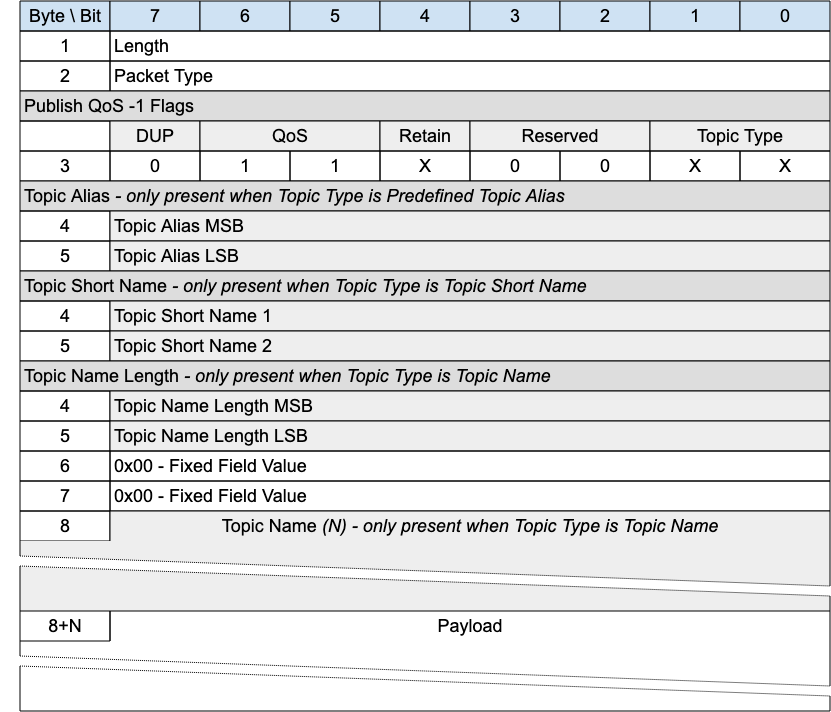

## C.6 PUBLISH with QoS -1{#c.6-publish-with-qos--1}

*Figure C-9 -- PUBLISH Packet for QoS -1*

<!-- .width="6.5in", .height="5.569444444444445in" -->

This packet is the MQTT-SN 1.2 equivalent of PUBWOS. It could be supported by a Server if there are existing MQTT-SN 1.2 transmitters that the Server wants to listen to, or receivers it wants to send to. Implementation of this packet is optional.

This packet can be used by both Clients and Servers to publish data to a topic without establishing a Virtual Connection or Session.

### C.6.1 PUBLISH Header{#c.6.1-publish-header}

The first 2 or 4 bytes of the packet are encoded according to the variable length packet header format. Refer to [sec](#structure-of-an-mqtt-sn-control-packet) for a detailed description.

### C.6.2 PUBLISH Flags{#c.6.2-publish-flags}

The PUBLISH Flags is a 1 byte field which contains flags specifying the content of the packet and the Server behavior. Bits 3-2 of the PUBLISH Flags are reserved and are set to 0.

The Client validates that the reserved flags in the PUBLISH packet are set to 0. If any of the reserved flags is not 0 it is a Malformed Packet.

#### C.6.2.1 Topic Type{#c.6.2.1-topic-type}

**Position**: bits 0 and 1 of the PUBLISH Flags.

This determines the format of the Topic Data field.

The Topic Type in MQTT-SN 1.2 is different to that in MQTT-SN 2.0. The values applicable to PUBLISH QoS -1 are:

- 0b00 - Topic Name. Its length is defined in the Topic Name Length field.

- 0b01 - Predefined Topic Alias.

- 0b10 - Short Topic Name. A two byte Topic Name, with the same syntax as Topic Name. However, some 1.2 implementations treated this as a binary field.

#### C.6.2.2 QoS{#c.6.2.2-qos}

**Position**: bits 5 and 6 of the PUBLISH Flags.

Set this field to "0b11" for QoS -1.

#### C.6.2.3 DUP{#c.6.2.3-dup}

**Position**: bit 7 of the PUBLISH Flags.

Set to 0.

#### C.6.2.4 Retain{#c.6.2.4-retain}

**Position**: bit 4 of the PUBLISH Flags.

This flag signifies whether the message is published as a retained message or not. See [sec](#retained-messages) for more information.

### C.6.3 Topic Alias{#c.6.3-topic-alias}

Only present if the Topic Type is Predefined Topic Alias. Contain a Topic Alias which is preconfigured to be known to both the sender and receiver.

### C.6.4 Topic Short Name{#c.6.4-topic-short-name}

Only present if the Topic Type is Short Topic Name.

This is a two byte Topic Name. This Topic Type does not exist in later versions of MQTT-SN. It existed because the original MQTT-SN 1.2 did not allow a Long Topic Name, so the only other option for this packet was a Predefined Topic Alias.

### C.6.5 Topic Name Length{#c.6.5-topic-name-length}

Only present if the Topic Type is Topic Name.

The length of the Topic Name field.

### C.6.6 Topic Name{#c.6.6-topic-name}

Only present if the Topic Type is Topic Name.

Topic Name is a UTF-8 encoded string of length Topic Name Length.

### C.6.7 Payload{#c.6.7-payload}

The Payload contains the payload data of the Application Message that is being published. The content and format of the data is application specific. It is valid for a PUBLISH packet to contain a zero length Payload.

### C.6.8 PUBLISH with QoS -1 Actions{#c.6.8-publish-with-qos--1-actions}

The Client or Server uses a PUBLISH QoS -1 packet to send an Application Message to a Network Address, for possible receipt by a Server or another Client.

If received by a Client or Server, the PUBLISH QoS -1 packet is treated as if its QoS were 0 as described in [sec](#publish-actions).
