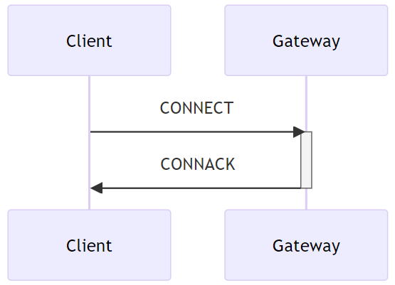
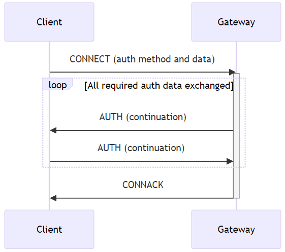

## Session state{#session-state}

In order to implement QoS 1 and QoS 2 protocol flows the Client and Server need to associate state with the Client Identifier, this is referred to as the Session State. The Server also stores the subscriptions as part of the Session State.

The Session can continue across a sequence of Virtual Connections. It lasts as long as the latest Virtual Connection plus the Session Expiry Interval.

The Session State in the Client consists of:

- QoS 1 and QoS 2 PUBLISH Packets which have been sent to the Server, but have not been completely acknowledged.

- QoS 2 PUBLISH Packets which have been received from the Server, but have not been completely acknowledged.

- Session Topic Alias mappings.

The Session State in the Server consists of:

- The existence of a Session, even if the rest of the Session State is empty.

- The Client's subscriptions.

- QoS 1 and QoS 2 PUBLISH Packets which have been sent to the Client, but have not been completely acknowledged.

- QoS 1 and QoS 2 PUBLISH Packets pending transmission to the Client and OPTIONALLY QoS 0 PUBLISH Packets pending transmission to the Client.

- QoS 2 PUBLISH Packets which have been received from the Client, but have not been completely acknowledged.

- The Will Message and associated Will data.

- If the Session is currently not connected, the time at which the Session will end and Session State will be discarded.

- Session Topic Alias mappings.

Retained messages do not form part of the Session State in the Server, they are not deleted as a result of a Session ending.

### Storing Session State{#storing-session-state}

«<mark title="Requirement MQTT-SN-4.1.1-1">The Server MUST NOT discard the Session State while the Virtual Connection exists</mark>»\[MQTT‑SN‑4.1.1‑1].

«<mark title="Requirement MQTT-SN-4.1.1-2">The Client MUST NOT discard the Session State while the Virtual Connection exists</mark>»\[MQTT‑SN‑4.1.1‑2].

«<mark title="Requirement MQTT-SN-4.1.1-3">The Server MUST discard the Session State when the Virtual Connection is deleted and the Session Expiry Interval has passed</mark>»\[MQTT‑SN‑4.1.1‑3]. A Session Expiry Interval of 0xFFFFFFFF is an infinite amount of time, so never passes.

**Informative comment**

> The storage capabilities of Client and Server implementations will of course have limits in terms of capacity and may be subject to administrative policies. Stored Session State can be discarded as a result of an administrator action, including an automated response to defined conditions. This has the effect of terminating the Session. These actions might be prompted by resource constraints or for other operational reasons. It is possible that hardware or software failures may result in loss or corruption of Session State stored by the Client or Server. It is prudent to evaluate the storage capabilities of the Client and Server to ensure that they are sufficient.

### Session Establishment{#session-establishment}

An MQTT-SN Client needs to create a session on the server, unless it is only publishing using PUBWOS packets. The procedure for setting up a session with a server is illustrated in figures 4-1 and 4-2.

The CONNECT packet contains flags to communicate to the Server that authentication interactions, with the AUTH packet, should take place.

*Figure 4-1 -- Connect Procedure (without Auth flag set, or no further authentication data required)*

<!-- .width="3.344815179352581in", .height="2.4173436132983377in" -->

*Figure 4-2 -- Connect Procedure (with Auth flag set and further authentication data required)*

<!-- .width="3.345165135608049in", .height="2.963542213473316in" -->

If the Server can not accept the CONNECT request the Server returns a CONNACK packet with the rejection Reason Code.

«<mark title="Requirement MQTT-SN-4.1.2-1">If the Client provides no client identifier, the Server MUST respond with a CONNACK containing an Assigned Client Identifier</mark>»\[MQTT‑SN‑4.1.2‑1].

«<mark title="Requirement MQTT-SN-4.1.2-2">An Assigned Client Identifier MUST be a new Client Identifier not used by any other Session currently in the Server</mark>»\[MQTT‑SN‑4.1.2‑2].
