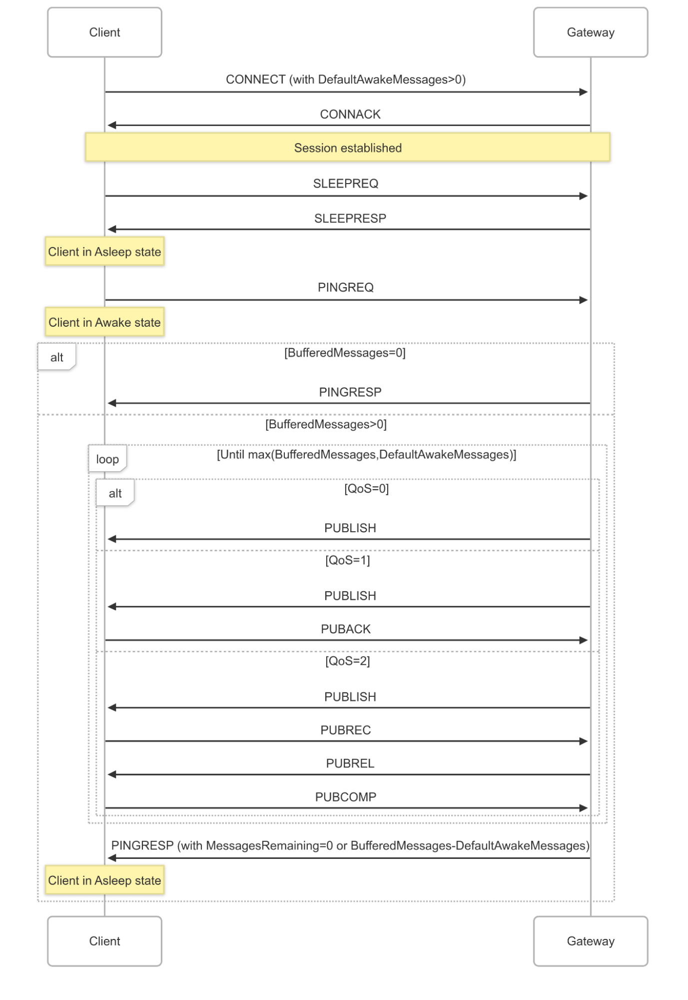

## Client states{#client-states}

At any time, a Client will be in one of the following states from the perspective of the Server:

*Figure 4-7 -- Client States*

| State            | State Description                                                                                                                                                                                                                                                                                                                                                                                                                                                                                                                                                                                         | Possible Transitions                                 |
|:-----------------|:----------------------------------------------------------------------------------------------------------------------------------------------------------------------------------------------------------------------------------------------------------------------------------------------------------------------------------------------------------------------------------------------------------------------------------------------------------------------------------------------------------------------------------------------------------------------------------------------------------|:-----------------------------------------------------|
| **None**         | The Client is unknown to the Server. There is no Session State nor Virtual Connection.  A Client may transition from here to **Active** with a CONNECT.                                                                                                                                                                                                                                                                                                                                                                                                                                             | **Active**                                           |
| **Disconnected** | The Client is considered offline and not able to receive packets until it has re-established a session with the Server by way of a CONNECT. The Server has Session state for this Client, but there is no Virtual Connection.   A Client may transition from here to **Active** with a CONNECT, or to **None** on Session expiry.                                                                                                                                                                                                                                                                   | **Active**  **None**                           |
| **Active**       | The Client is actively engaged in the Session. A Virtual Connection exists. It should be able to send and receive packets. Its state is supervised by the Server with the associated Keep Alive timer.   A Client may transition from here to **Asleep** by way of a SLEEPREQ or **Disconnected** by way of a DISCONNECT, Keep Alive timeout or Retry timeout.                                                                                                                                                                                                                                      | **Asleep**  **Disconnected**                   |
| **Asleep**       | The Client is engaged in an ongoing Session, and a Virtual Connection exists. The Client cannot receive Packets (except possibly the WAKEUP hint); it can send Packets. The Server should not expect a response from the client in this state.   A Client may transition from here to **Awake** (by way of PINGREQ), **Active** by way of CONNECT, **Disconnected** (by way of DISCONNECT, Sleep timeout or Retry timeout).   The Server may send a WAKEUP packet to the Client, as an indication that messages are waiting - it is up to the Client to act, if it is even able to notice it. | **Awake**  **Active**  **Disconnected**  |
| **Awake**        | The Client is partially engaged in an ongoing session and a Virtual Connection exists.   The client transitions back to the **Asleep** state on receipt of a PINGRESP packet or **Disconnected** (by way of DISCONNECT, or on Keep Alive or Retry timeout for the possible PUBACK, PUBREL, PUBREC, PUBCOMP or REGACK packets to be received from the Client). The Client may also move to the **Active** state by way of CONNECT.                                                                                                                                                                   | **Asleep**  **Active**  **Disconnected** |

«<mark title="Requirement MQTT-SN-4.14-1">A Server **MUST NOT** attempt to send packets to a Disconnected Client</mark>»\[MQTT‑SN‑4.14‑1].

«<mark title="Requirement MQTT-SN-4.14-2">Any packet except CONNECT received from a Disconnected Client MUST NOT be processed</mark>»\[MQTT‑SN‑4.14‑2]. A DISCONNECT with error should be sent in response, unless the packet received is PUBWOS.

«<mark title="Requirement MQTT-SN-4.14-3">In the Asleep state, a Client MUST only send PINGREQ, CONNECT or DISCONNECT packets to the Server</mark>»\[MQTT‑SN‑4.14‑3].

«<mark title="Requirement MQTT-SN-4.14-4">In the Awake state, a Client MUST not send ANY packets other than those involved in the receipt of PUBLISH packets (PUBACK, PUBREC, PUBCOMP, REGACK) or CONNECT or DISCONNECT</mark>»\[MQTT‑SN‑4.14‑4].

«<mark title="Requirement MQTT-SN-4.14-5">Whenever a CONNECT is received by a Server, any existing Virtual Connection for that Client MUST be deleted and a new one created with all CONNECT Packet processing, regardless of the state of the Client</mark>»\[MQTT‑SN‑4.14‑5].

Transition through these states is governed by a sequence of packets between Client and Server and mediated by [[timers]](#session-timers) resident on the Server. A Client is in the Active state when the Server receives a CONNECT packet from that Client. This state is supervised by the Server with the [[3.1.6 Keep Alive]](#keep-alive) timer. If the Server does not receive any packet from the Client in a defined period, the Server will consider that client as Disconnected and delete the Virtual Connection. The Disconnected state is governed by the Session Expiry timer - on expiry the Server is free to remove the Client session. A Client moves into the Asleep state by issuing a SLEEPREQ packet. To be certain that the Server has also recorded the Client as being asleep, the Client needs to wait for a positive SLEEPRESP response. For more information on the Asleep state, refer to [[4.14.2 Sleeping Clients]](#sleeping-clients).

See [[C.5 Client State Diagrams]](#c.5-client-state-diagrams) for informative state diagrams to help illustrate these transitions.

> **Informative Comment**
>
> In MQTT-SN 1.2 there existed a Lost state, which was identical to the Disconnected state, except that it was reached by a timer expiry on the Server rather than an explicit Disconnect request from the Client. As the Lost state was not really different from Disconnected except for the history of Client events, similar information may be kept by the Server, in for instance its administrative logs.

### Session Timers{#session-timers}

The following timers are used by Servers, on a per Client basis, to handle Client states, and by Clients to direct their actions. In general, Clients are able to infer the Server's view of their state by observing the Server's response.

*Figure 4-8 -- Session Timers*

| Timer Name     | State(s)              | Timeout State | Defined in           | Information                                              |
|:---------------|:----------------------|:--------------|:---------------------|:---------------------------------------------------------|
| Keep Alive     | Active                | Disconnected  | CONNECT              | \[[3.1.6 Keep Alive](#keep-alive)]                       |
| Sleep Duration | Asleep                | Disconnected  | SLEEPREQ             | \[[4.14.2 Sleeping Clients](#sleeping-clients)]          |
| Session Expiry | Disconnected          | None          | CONNECT, DISCONNECT  | \[[4.1.1 Storing Session State](#storing-session-state)] |
| Retry          | Active, Awake, Asleep | Disconnected  | Sender configuration | \[[4.4 Packet delivery retry](#packet-delivery-retry)]   |

For example values of these timers, see [[C.3 Example Timer and Counter Values]](#c.3-example-timer-and-counter-values).

### Sleeping Clients{#sleeping-clients}

The Asleep state is intended to allow Clients, which may be running on battery powered devices, to save as much energy as possible. These Clients enter a low-power mode when they are not active, and will wake when they have data to send or receive. The Server needs to be aware of the sleeping state of these Clients and buffer messages destined for them, so that they may be delivered when the Clients wake up.

To go to sleep, a Client sends a SLEEPREQ packet containing a Sleep Duration in seconds. The Server acknowledges that packet with a SLEEPRESP Packet including a successful Reason Code, and considers the Client to be Asleep.

«<mark title="Requirement MQTT-SN-4.14.2-1">If the Server does not receive an MQTT-SN Control Packet from an Asleep Client within one and a half times the Sleep Duration, it MUST delete the Virtual Connection to the Client</mark>»\[MQTT‑SN‑4.14.2‑1]. The Client will then be considered to be Disconnected.

«<mark title="Requirement MQTT-SN-4.14.2-2">During the Asleep state, packets that need to be sent to the client are buffered at the Server. The Server MUST buffer Application Messages of QoS 1 and 2</mark>»\[MQTT‑SN‑4.14.2‑2].

> **Informative comment**
>
> The Server may *choose* to buffer messages of QoS 0 while the Client is in the Asleep state.

The Client wakes by sending a PINGREQ. If the Server has buffered packets for the Client, it will send them to the Client, acknowledging the Default Awake Messages value sent in the CONNECT packet. «<mark title="Requirement MQTT-SN-4.14.2-3">If the number of messages buffered on the Server waiting to be sent exceeds the value specified by the client in the Default Awake Messages field, the Server MUST send only the Default Awake Messages value number of messages</mark>»\[MQTT‑SN‑4.14.2‑3].

«<mark title="Requirement MQTT-SN-4.14.2-4">It cuts short the AWAKE cycle, and MUST respond with a PINGRESP with a messages-left value of either the number of messages remaining in the Server buffer or 0xFFFF (meaning undetermined number of messages greater than 0 remaining)</mark>»\[MQTT‑SN‑4.14.2‑4].

«<mark title="Requirement MQTT-SN-4.14.2-5">During the Awake state, for each Application Message the Server sends to the Client, the application messages' quality of service MUST be honored - a full packet interaction MUST take place including all normative phases of acknowledgement, including any associated retransmission logic</mark>»\[MQTT‑SN‑4.14.2‑5].

«<mark title="Requirement MQTT-SN-4.14.2-6">If, during the delivery of Application Messages from the Server to the Client, and applying the <mark title="Ephemeral region marking">[retry logic]](#unacknowledged-packets), the Server gets no response, it MUST consider the Client disconnected and delete the Virtual Connection</mark>»\[MQTT‑SN‑4.14.2‑6]. [I</mark>t may send a DISCONNECT packet with an appropriate Reason Code.

The transfer of packets to the Client is closed by the Server by means of a PINGRESP packet. That is, the Server will consider the Client as Asleep and restart the Sleep Duration timer after having sent the PINGRESP packet. «<mark title="Requirement MQTT-SN-4.14.2-7">If the Server does not have any packets buffered for the client, it MUST respond immediately with a PINGRESP packet</mark>»\[MQTT‑SN‑4.14.2‑7], returning the Client back to the Asleep state, and restarting the Sleep Duration timer for that Client.

After having sent the PINGREQ to the Server, the Client uses the retransmission procedure of [[4.4 Packet delivery retry]](#packet-delivery-retry) to supervise the arrival of packets sent by the Server. To avoid draining its battery due to excessive retransmission of the PINGREQ packet, the Client should limit the retransmission with a Maximum Retry Count, and go back to sleep when the limit is reached.

At some point after several Awake periods without any response from the Server, a Client might decide that it needs to try to connect to a different Server. The Client might send a DISCONNECT Packet to try to notify the original Server, or just delete its Virtual Connection.

From the *Asleep* state, a client can move to the *Active* state by sending a CONNECT packet or to the *Disconnected* state by sending a DISCONNECT packet. The Client can also modify its sleep configuration by sending a SLEEPREQ Packet with a new value of Sleep Duration.

Note that a sleeping Client should go to the *Awake* state only if it wants to check whether the Server has any Application Messages buffered for it and return as soon as possible to the *Asleep* state without sending any packets to the Server (other than PUBACK, PUBREC, PUBCOMP or REGACK). If it wants to do more than this, it needs to create a new Virtual Connection by sending a CONNECT packet to the Server.

Session Topic Aliases last for the duration of a Session which exists throughout the sleep cycle. However, if the Client wants to save storage by removing the Session Topic Aliases while Asleep, it can set the Retain Topic Aliases flag on the SLEEPREQ packet to 0. The disadvantage being that during the Awake state, Session Topic Aliases will have to be recreated, or Topic Names used instead, increasing network data usage.

*Figure 4-9 -- Awake PINGRESP Packet flush*

<!-- .width="4.615764435695538in", .height="7.453125546806649in" -->
