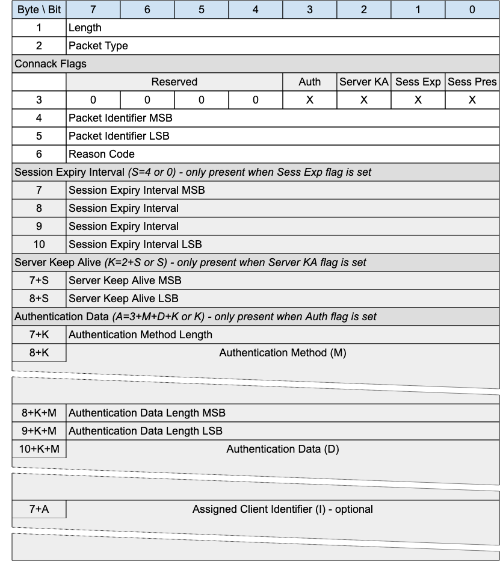

## CONNACK - Connect Acknowledgement{#connack---connect-acknowledgement}

*Figure 3-3 -- CONNACK Packet*

<!-- .width="6.5in", .height="7.291666666666667in" -->

The CONNACK packet is sent by the Server in response to a CONNECT request from a client.

### CONNACK Header{#connack-header}

The first 2 or 4 bytes of the packet are encoded according to the variable length packet header format.
Refer to [sec](#structure-of-an-mqtt-sn-control-packet) for a detailed description.

### CONNACK Flags{#connack-flags}

The CONNACK Flags is a 1 byte field which contains flags specifying the behavior of the MQTT-SN Virtual Connection on the Server.
«<mark title="Requirement MQTT-SN-3.2.2-1">Bits 7-2 of the CONNACK Flags are reserved and MUST be set to 0</mark>»\[MQTT‑SN‑3.2.2‑1].

«<mark title="Requirement MQTT-SN-3.2.2-2">The Client MUST validate that the reserved flags in the CONNACK packet are set to 0. If any of the reserved flags is not 0 it is a Malformed Packet</mark>»\[MQTT‑SN‑3.2.2‑2].

#### Session Present

**Position**: bit 0 of the CONNACK Flags. Labelled *Sess Pres* in Figure 3-6.

Specifies whether an existing session was present on the Server for the given client identifier. A value of 1 indicates a session was present, a value 0 indicates no session was present.

«<mark title="Requirement MQTT-SN-3.2.2.1-1">If the Server accepts a CONNECT with Clean Start set to 1, the Server MUST set Session Present to 0 in the CONNACK Packet in addition to setting a 0x00 (Success) Reason Code in the CONNACK packet</mark>»\[MQTT‑SN‑3.2.2.1‑1].

«<mark title="Requirement MQTT-SN-3.2.2.1-2">If the Server accepts a CONNECT with Clean Start set to 0 and the Server has Session State for the client identifier it MUST set Session Present to 1 in the CONNACK packet, otherwise it MUST set Session Present to 0 in the CONNACK packet. In both cases it MUST set a 0x00 (Success) Reason Code in the CONNACK packet</mark>»\[MQTT‑SN‑3.2.2.1‑2].

If the value of Session Present received by the Client from the Server is not as expected, the Client proceeds as follows:

«<mark title="Requirement MQTT-SN-3.2.2.1-3">If the Client does not have Session State and receives Session Present set to 1 it MUST delete the Virtual Connection.]{.mark} [If it wishes to restart with a new Session the Client can reconnect using Clean Start set to 1</mark>»\[MQTT‑SN‑3.2.2.1‑3].

«<mark title="Requirement MQTT-SN-3.2.2.1-4">If the Client does have Session State and receives Session Present set to 0 it MUST discard its Session State if it continues with the Virtual Connection</mark>»\[MQTT‑SN‑3.2.2.1‑4].

«<mark title="Requirement MQTT-SN-3.2.2.1-5">If a Server sends a CONNACK packet containing a non-zero Reason Code it MUST set Session Present to 0</mark>»\[MQTT‑SN‑3.2.2.1‑5].

#### Session Expiry Interval Flag{#session-expiry-interval-flag}

**Position**: bit 1 of the CONNACK Flags. Labelled *Sess Exp* in Figure 3-6.

​​«<mark title="Requirement MQTT-SN-3.2.2.2-1">If the Session Expiry Interval Flag is set to 0, a Session Expiry Interval MUST NOT be present in the Packet</mark>»\[MQTT‑SN‑3.2.2.2‑1].

«<mark title="Requirement MQTT-SN-3.2.2.2-2">If the Session Expiry Interval Flag is set to 1, a Session Expiry Interval MUST be present in the Packet</mark>»\[MQTT‑SN‑3.2.2.2‑2].

#### Server Keep Alive Flag{#server-keep-alive-flag}

**Position**: bit 2 of the CONNACK Flags. Labelled *Server KA* in Figure 3-6.

Indicates whether the packet includes a Server Keep Alive or not.

​​«<mark title="Requirement MQTT-SN-3.2.2.3-1">If the Server Keep Alive Flag is set to 0, a Server Keep Alive field MUST NOT be present in the Packet</mark>»\[MQTT‑SN‑3.2.2.3‑1].

«<mark title="Requirement MQTT-SN-3.2.2.3-2">If the Server Keep Alive Flag is set to 1, a Server Keep Alive field MUST be present in the Packet</mark>»\[MQTT‑SN‑3.2.2.3‑2].

#### Authentication Flag{#cca---authentication-flag}

**Position**: bit 3 of the CONNACK Flags. Labelled *Auth* in Figure 3-6.

Specifies whether the packet contains authentication material to be considered.

«<mark title="Requirement MQTT-SN-3.2.2.4-1">If the Authentication Flag is set to 0, Authentication Method and Data MUST NOT be present in the Packet</mark>»\[MQTT‑SN‑3.2.2.4‑1].

«<mark title="Requirement MQTT-SN-3.2.2.4-2">If the Authentication Flag is set to 1, Authentication Method and Data MUST be present in the Packet</mark>»\[MQTT-SN-3.2.2.4-2\].

### Packet Identifier{#cca---packet-identifier}

The same value as the Packet Identifier in the CONNECT or AUTH Packet being acknowledged.

### Reason Code{#cca---reason-code}

The values for Reason Codes are shown in [sec](#reason-code).
«<mark title="Requirement MQTT-SN-3.2.4-1">The Server sending the CONNACK Packet MUST use one of the Reason Codes applicable to CONNACK</mark>»\[MQTT‑SN‑3.2.4‑1].

«<mark title="Requirement MQTT-SN-3.2.4-2">If a Server sends a CONNACK packet containing a Reason code of 0x80 or greater it MUST then delete the Virtual Connection</mark>»\[MQTT‑SN‑3.2.4‑2].

> **Informative comment**
>
> Reason Code 0x80 (Unspecified error) may be used where the Server knows the reason for the failure but does not wish to reveal it to the Client, or when none of the other Reason Code values applies.

### Session Expiry Interval{#cca---session-expiry-interval}

If the Session Expiry Interval is absent the value of Session Expiry Interval in the CONNECT Packet is used. The Server uses this field to inform the Client that it is using a value other than that sent by the Client in the CONNECT.

Refer to [sec](#session-expiry-interval) for a description of the use of Session Expiry Interval.

### Server Keep Alive{#server-keep-alive}

The Server uses this field to inform the Client that it is using a value other than that sent by the Client in the CONNECT.

«<mark title="Requirement MQTT-SN-3.2.6-1">If the Server sends a Server Keep Alive on the CONNACK packet, the Client MUST use this value instead of the Keep Alive value the Client sent on CONNECT</mark>»\[MQTT‑SN‑3.2.6‑1].

«<mark title="Requirement MQTT-SN-3.2.6-2">If the Server does not send the Server Keep Alive, the Server MUST use the Keep Alive value set by the Client on CONNECT</mark>»\[MQTT‑SN‑3.2.6‑2].

Refer to [sec](#keep-alive) for a description of the use of Keep Alive Interval.

> **Informative comment**
>
> The primary use of the Server Keep Alive is for the Server to inform the Client that it will disconnect the Client for inactivity sooner than the Keep Alive specified by the Client.

### Authentication Method Length{#cca---authentication-method-length}

Single byte value (max 0-255 bytes), representing the length of field used to specify the authentication method. Refer to [sec](#authentication) for more information about authentication.

### Authentication Method{#cca---authentication-method}

A UTF-8 Encoded String containing the name of the authentication method. Refer to [sec](#authentication) for more information about authentication.

### Authentication Data Length{#cca---authentication-data-length}

Two byte value (max 0-65535 bytes), representing the length of field used to specify the authentication data. Refer to [sec](#authentication) for more information about authentication.

### Authentication Data{#cca---authentication-data}

Binary Data containing authentication data. The contents of this data are defined by the authentication method and the state of already exchanged authentication data. Refer to [sec](#authentication) for more information about authentication.

### Assigned Client Identifier{#assigned-client-identifier}

«<mark title="Requirement MQTT-SN-3.2.11-1">The Assigned Client Identifier MUST be a UTF-8 Encoded String</mark>»\[MQTT‑SN‑3.2.11‑1]. This field is optional - its existence or absence is inferred from the Packet length.

The Assigned Client Identifier is the Client Identifier assigned by the Server when the associated CONNECT packet contained no Client Identifier. «<mark title="Requirement MQTT-SN-3.2.11-3">If the Client connects using a zero length Client Identifier, the Server MUST respond with a CONNACK containing an Assigned Client Identifier]{.mark} \[MQTT-SN-3.2.11-2\].[The Assigned Client Identifier MUST be a new Client Identifier not used by any other Session currently in the Server</mark>»\[MQTT‑SN‑3.2.11‑3].

It is suggested that the 36 character Universally Unique IDentifier (UUID) format described in RFC9562 is used for MQTT-SN Assigned Client Identifiers. In any case they should be no longer than 36 characters.

(RFC9562 describes UUIDs that are 128 bits in size, 16 bytes or 32 hexadecimal digits. These UUIDs are commonly expressed in 36 characters, including 4 dashes as separators such as the following: *f81d4fae-7dec-11d0-a765-00a0c91e6bf6*.)

> **Informative comment**
>
> The length of Assigned Client Identifiers should take into account the maximum packet size allowed by the MQTT-SN implementation.
>
> **Informative comment**
>
> Where a Transparent Gateway receives an Assigned Client Identifier from an MQTT Server which is deemed too long for a device, it should map shorter Gateway generated Client Identifiers with their versions returned from the MQTT Server.
