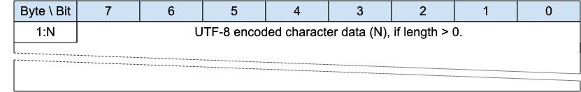
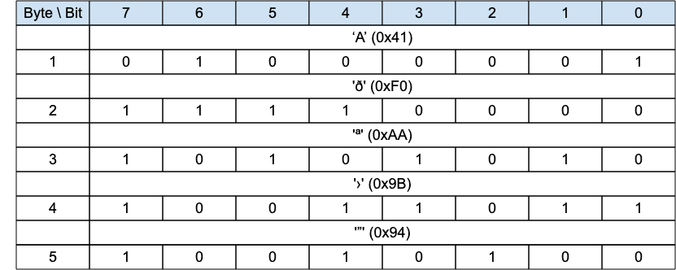

## Data representation{#data-representation}

### Bits (Byte){#bits-byte}

Bits in a byte are labeled 7 to 0. Bit number 7 is the most significant bit, the least significant bit is assigned bit number 0.

### Two Byte Integer{#two-byte-integer}

Two Byte Integer data values are 16-bit unsigned integers in big-endian order: the high order byte precedes the lower order byte. This means that a 16-bit word is presented on the network as Most Significant Byte (MSB), followed by Least Significant Byte (LSB).

### Four Byte Integer{#four-byte-integer}

Four Byte Integer data values are 32-bit unsigned integers in big-endian order: the high order byte precedes the successively lower order bytes. This means that a 32-bit word is presented on the network as Most Significant Byte (MSB), followed by the next most Significant Byte (MSB), followed by the next most Significant Byte (MSB), followed by Least Significant Byte (LSB).

### UTF-8 Encoded String{#utf-8-encoded-string}

Text fields within the MQTT-SN Control Packets are encoded as fixed length UTF-8 strings. UTF-8 [cite](#RFC3629) is an efficient encoding of Unicode [cite](#Unicode) characters that optimizes the encoding of ASCII characters in support of text-based communications.

Unless stated otherwise all variable length UTF-8 encoded strings can have any length in the range 0 to 65,535 bytes.

*Figure 1-1 -- Structure of UTF-8 Encoded Strings*

<!-- .width="6.5in", .height="1.0277777777777777in" -->

«<mark title="Requirement MQTT-SN-1.7.4-1">The character data in a UTF-8 Encoded String MUST be well-formed UTF-8 as defined by the Unicode specification [cite](#Unicode) and restated in RFC 3629 [cite](#RFC3629). In particular, the character data MUST NOT include encodings of code points between U+D800 and U+DFFF</mark>»\[MQTT‑SN‑1.7.4‑1].

If the Client or Server receives an MQTT-SN Control Packet containing ill-formed UTF-8 it is a Malformed Packet. Refer to [sec](#handling-errors) for information about handling errors.

«<mark title="Requirement MQTT-SN-1.7.4-2">A UTF-8 Encoded String MUST NOT include an encoding of the null character U+0000</mark>»\[MQTT‑SN‑1.7.4‑2]. If a receiver (Server or Client) receives an Control Packet containing U+0000 in a UTF-8 Encoded String it is a Malformed Packet.

UTF-8 Encoded Strings SHOULD NOT include the Unicode \[Unicode\] code points listed below. If a receiver (Server or Client) receives an MQTT-SN Control Packet with UTF-8 Encoded Strings containing any of them it MAY treat it as a Malformed Packet. These are the Disallowed Unicode code points.

- U+0001..U+001F control characters

- U+007F..U+009F control characters

- Code points defined in the Unicode specification [cite](#Unicode) to be non-characters (for example U+0FFFF)

«<mark title="Requirement MQTT-SN-1.7.4-3">A UTF-8 encoded sequence 0xEF 0xBB 0xBF is always interpreted as U+FEFF (\"ZERO WIDTH NO-BREAK SPACE\") wherever it appears in a string and MUST NOT be skipped over or stripped off by a packet receiver</mark>»\[MQTT‑SN‑1.7.4‑3].

> **Informative example**
>
> For example, the string A𪛔 which is LATIN CAPITAL Letter A followed by the code point U+2A6D4 (which represents a CJK IDEOGRAPH EXTENSION B character) is encoded as follows:

*Figure 1-2 -- Fixed Length UTF-8 Encoded String informative example*

<mark title="Ephemeral region marking">\[figure below is part of informative example\]</mark>

